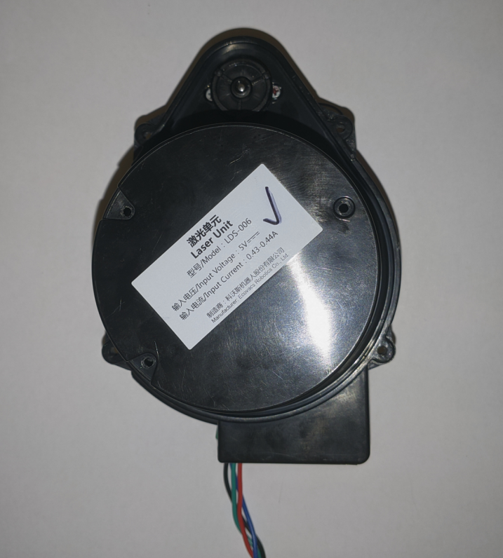
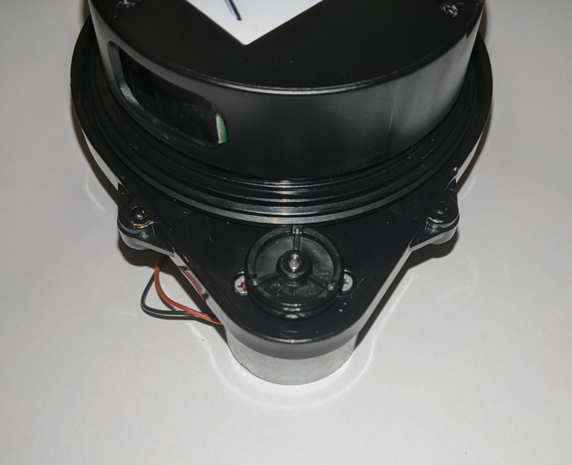
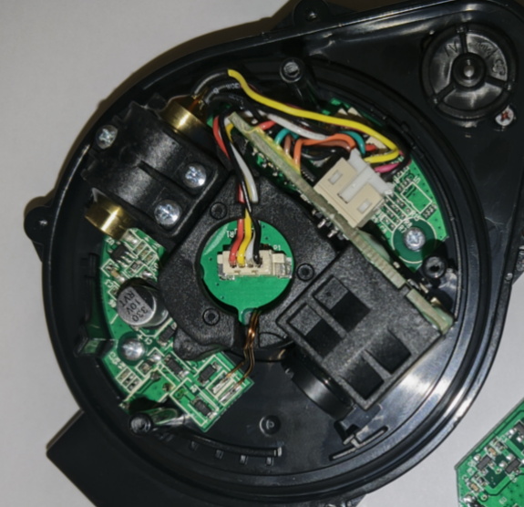
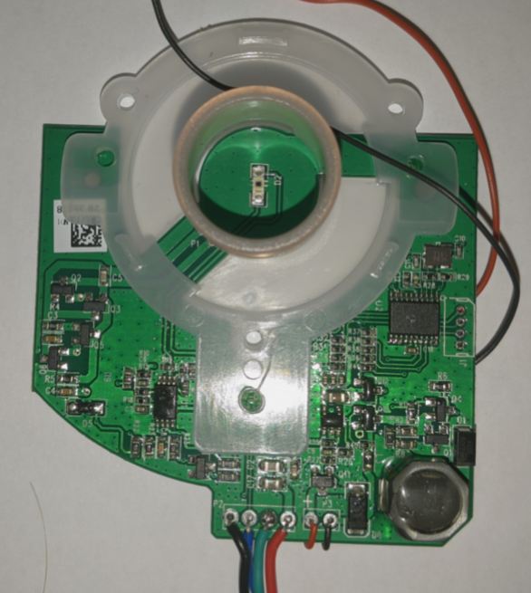

# LDS-006 Lidar
## Blog Posts
The blog posts are more related to some of the work that went into this page, as well as some of my thoughts on things:  

[(Mis)adventures With the LDS-006 Lidar](../posts/005-LDS-006-Hacking.md)  
[Updates on the LDS-006 Lidar](../posts/007-LDS-006-Is-Smelly.md)  
[Fixing Periodic Resets of LDS-006 CPU](../posts/009-GD32-Reset-Fix.md)  
[First Attempts at Decoding Serial Data](../posts/010-Decoding-Serial-Data.md)  
[Hardware Hacking and other Serial Data Stuff](../posts/011-Attempts-Serial-Stuff.md)  

## General Overview
The LDS-006 is a 360 degree lidar commonly found in the Ecovacs DeeBot line of robotic vacuums. Generally a part similar to the LDS-006 would cost over £50, with many higher end ones costing over £100 (see [here](https://www.aliexpress.com/wholesale?catId=0&SearchText=lidar) for reference). However this lidar could be found for as little as $7 (plus shipping and tax) on Aliexpress, listed as being salvaged / taken from Ecovacs vacuums.

<figure>

<figcaption style="font-style: italic;">
</figcaption>
</figure>

<figure>

<figcaption style="font-style: italic;">
</figcaption>
</figure>

My motivation for messing with these modules came from a [Marco Reps](https://www.youtube.com/user/reppesis) video where he [messes with a Xiaomi vacuum lidar](https://www.youtube.com/watch?v=4sQCz75BfrM). The price of such modules put me off for some time, but after discovering the LDS-006 I knew I wanted to mess with it.

## Hardware
There are 4 wires coming from the module. They are:
```
black: GND
red: VCC (5v)
blue: UART TX (3v3)
green: UART RX (3v3)
```
The module has two distinct parts to it; first is the spinning assembly with laser, and second is the motor control / serial comms board.

## Spinning Assembly
<figure>

<figcaption style="font-style: italic;">
</figcaption>
</figure>

The spinning assembly contains a main board which handles power supply stuff, and a daughter board which houses an ADC and a GD32F\[something\] microcontroller. \[**More info to come here in the future**\]

Power is inductively coupled to the spinning part, and data is sent back via an infrared LED and IR receiver on the controller board. 

## Controller Board and Motor Assembly
<figure>

<figcaption style="font-style: italic;">
</figcaption>
</figure>

This board handles power supply stuff, data handling, and serial comms control. The main microcontroller is a GD32F130P6F6 on the top right of the board.

### Connections to the uC
- The blue wire connects to PA2 via a 100ohm resistor
- The green wire connects to PA3 via a 100ohm resistor
  - These are the USART-1 TX and RX pins respectively
  - The UART isn't 5v tolerant
- The motor is controlled via PWM on PA4
  - Control of the motor via software is not yet understood
- The SWD debug port is visible to the right of the uC, and its pinout is GND->SWCLK->SWDIO->3v3 (from bottom pin to top pin)
  - You can connect to it via an STLink (clone) and it works fine with the `stm32f1x.cfg` file since this uC is a clone of the stm32f103

## Serial Data
\[**TODO**\]
