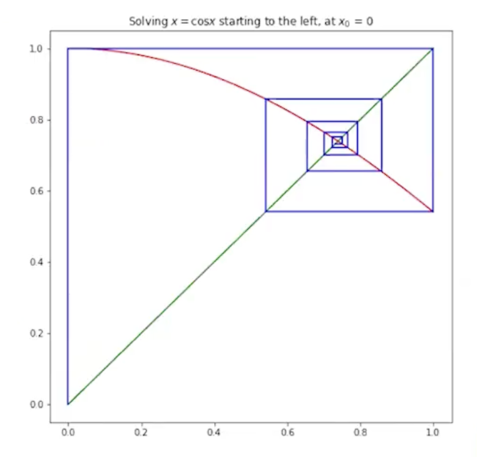

## Fixed Point Calculations and Finding Roots
### Fixed Points
- `c` is a fixed point in a function `f` if
  - `c` belongs to the domain and codomain of `f`
  - `f(c) = c`
  - The function returns the same value of its argument
- This can be calcuated by iterating a number of times and looking for convergence
- We can interpret this as ƒinding the intercept with `y=x`

<figure>

<figcaption style="font-style: italic;">
Example of fixed point of cosx
</figcaption>
</figure>

```cpp
double fixed_point(double f(double), int max_it, double init) {
  double x = init;
  for (int i = 0; i < max_it; i++) 
    x = f(x);
  return x;
}
```

- The code above shows a higher order fixed point calculation function - see the syntax for higher order functional arguments in C++

```cpp
fixed_point([](double x) -> double { return std::cos(x); }, 100, 0.75) // calculating the fixed point of the cosine function
```

- Again seeing lambda function syntax in C++

### Finding Roots of Equations Iteratively
- To find the roots of an equation `y=f(x)` (the points where `f(x) = 0`) iteratively, we can:
  - Convert it to a form `x=g(x)`
  - Start with an initial guess `x0~=r`
  - Iterate; `x_(n+1) = g(x_n)` for `n=1,2,3...`
- If this sequence converges to a limit `r` and the function `g` is contiguous at `x=r` then the limit `r` is a root of the equation

```cpp
double fixed_point(double f(double), int max_it, double init, double epsilon = 1e-10) {
  double x = init;

  for (int i = 0; i < max_iterations; i++) {
    double x1 = f(x);

    double error = fabs(x1-x);
    if (error < epsilon)
      break

    x = x1;
  }

  return x
}
```

- We introduce a new parameter `epsilon` which measures the difference between the last and current iteration, breaking when this gets small enough
- C++ has default arguments!
