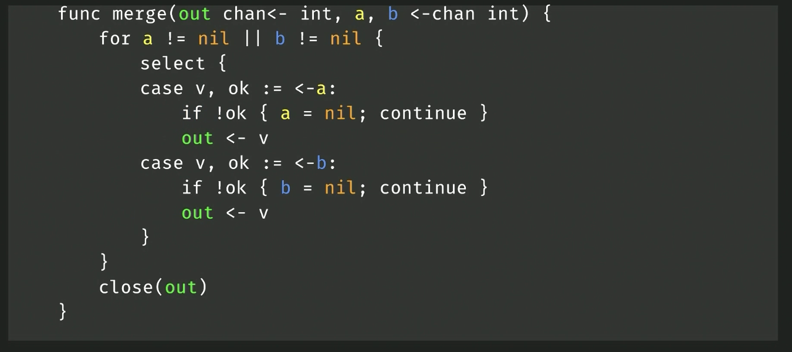
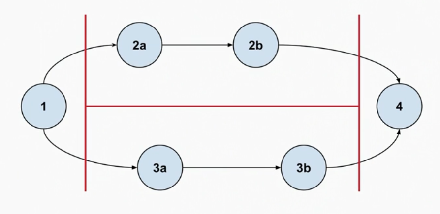
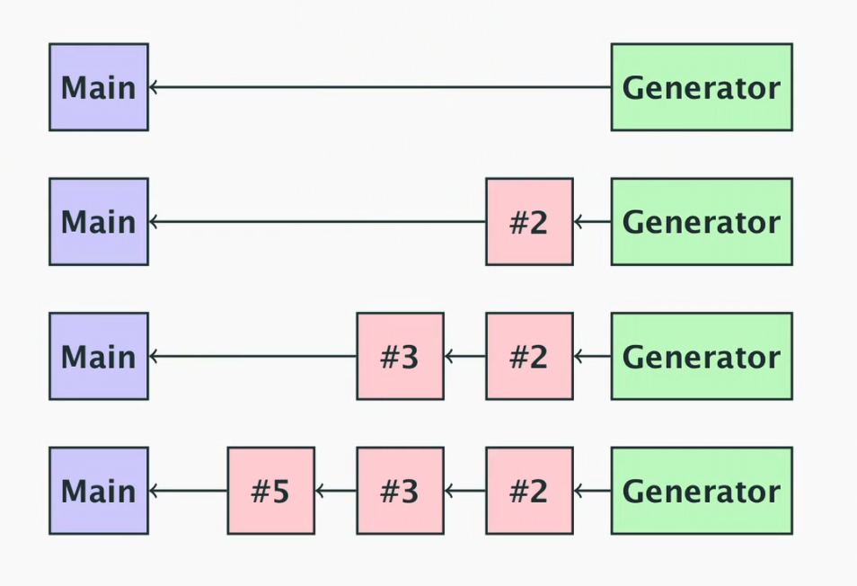

# Matt Holiday Go Class (YouTube)
Notes from learning the fundamentals of the Go programming language from [this amazing tutorial](https://www.youtube.com/playlist?list=PLoILbKo9rG3skRCj37Kn5Zj803hhiuRK6). It is a fantastic video tutorial on YouTube that explains Go concepts from the ground up and offers some great insight into the language design 

- [Matt Holiday Go Class (YouTube)](#matt-holiday-go-class-youtube)
  - [Variables](#variables)
  - [Strings](#strings)
  - [Arrays and Slices](#arrays-and-slices)
  - [Maps](#maps)
  - [Various Builtin Functions](#various-builtin-functions)
  - [`nil` (From https://www.youtube.com/watch?v=ynoY2xz-F8s)](#nil-from-httpswwwyoutubecomwatchvynoy2xz-f8s)
    - [Nil Interfaces](#nil-interfaces)
  - [Control Statements](#control-statements)
  - [Packages](#packages)
  - [Imports](#imports)
  - [Variable Declarations](#variable-declarations)
    - [Short Declaration Operator `:=`](#short-declaration-operator-)
    - [Typing](#typing)
      - [Structural and Named Typing](#structural-and-named-typing)
  - [Functions (Video 8)](#functions-video-8)
    - [Parameter Passing](#parameter-passing)
    - [Multiple Return Values](#multiple-return-values)
    - [Naked Return Values](#naked-return-values)
    - [Defer](#defer)
  - [Closures (Video 9)](#closures-video-9)
  - [More on Slices (Video 10)](#more-on-slices-video-10)
    - [The Slice Operator](#the-slice-operator)
      - [The Slice Capacity Issue](#the-slice-capacity-issue)
    - [Array and Slice APIs From Here](#array-and-slice-apis-from-here)
  - [Structs and JSON (Video 12)](#structs-and-json-video-12)
    - [Maps of Structs](#maps-of-structs)
    - [Structure \& Name Compatibility of Structs](#structure--name-compatibility-of-structs)
    - [JSON with Structs](#json-with-structs)
  - [Reference and Value Semantics (Video 14)](#reference-and-value-semantics-video-14)
    - [More on Copying](#more-on-copying)
    - [Stack Usage and Escaping](#stack-usage-and-escaping)
  - [HTTP and Networking in Go (Video 15)](#http-and-networking-in-go-video-15)
  - [OOP Concepts in Go (Videos 17-20)](#oop-concepts-in-go-videos-17-20)
    - [An Overview](#an-overview)
    - [Methods and Interfaces](#methods-and-interfaces)
    - [Interface Declarations](#interface-declarations)
    - [Composition in Go](#composition-in-go)
    - [Composition with Sorting Example](#composition-with-sorting-example)
    - [Making Nil Useful](#making-nil-useful)
    - [Exploring Value / Pointer Method Semantics](#exploring-value--pointer-method-semantics)
  - [More on Interfaces (Video 20)](#more-on-interfaces-video-20)
    - [The Error Interface](#the-error-interface)
    - [More on Pointer vs Value Receivers from Matt Holiday Vid](#more-on-pointer-vs-value-receivers-from-matt-holiday-vid)
    - [Interfaces in Practice](#interfaces-in-practice)
    - [_Be liberal in what you accept, be conservative in what you return_](#be-liberal-in-what-you-accept-be-conservative-in-what-you-return)
    - [Empty Interfaces](#empty-interfaces)
  - [Revisiting *Understanding nil*](#revisiting-understanding-nil)
    - [Zero Values](#zero-values)
    - [Nil](#nil)
    - [Understanding the Different Types of `nil`](#understanding-the-different-types-of-nil)
    - [Nil Interfaces](#nil-interfaces-1)
    - [How is Nil Useful](#how-is-nil-useful)
      - [Nil Pointers](#nil-pointers)
      - [Nil Slices](#nil-slices)
      - [Nil Slices](#nil-slices-1)
  - [Function Currying](#function-currying)
    - [Method Values](#method-values)
  - [Notes From Homework #4](#notes-from-homework-4)
  - [Concurrency (Finally!) (Video 22)](#concurrency-finally-video-22)
    - [Defining Concurrency](#defining-concurrency)
    - [Concurrency vs Parallelism](#concurrency-vs-parallelism)
    - [Race Conditions](#race-conditions)
  - [Concurrency In Go (Video 23)](#concurrency-in-go-video-23)
    - [Channels Overview](#channels-overview)
    - [Goroutines Overview](#goroutines-overview)
    - [`http.HandlerFunc` Channel Pattern](#httphandlerfunc-channel-pattern)
    - [Prime Sieve Example](#prime-sieve-example)
  - [Select (Video 24)](#select-video-24)
    - [Default Case](#default-case)
  - [Context (Video 25)](#context-video-25)
    - [The Context Tree](#the-context-tree)
    - [Context With Values](#context-with-values)
  - [More on Channels (Video 26)](#more-on-channels-video-26)
    - [Closed Channels](#closed-channels)
    - [Nil Channels](#nil-channels)
    - [Rendezvous Model](#rendezvous-model)
    - [Buffering](#buffering)
    - [Important Note](#important-note)
    - [Why Buffering](#why-buffering)
  - [Concurrent File Processing Example (Video 27)](#concurrent-file-processing-example-video-27)
    - [Concurrent Approaches](#concurrent-approaches)
      - [Worker Pool](#worker-pool)
      - [Goroutine for Each Directory in the Tree Approach](#goroutine-for-each-directory-in-the-tree-approach)
      - [No Workers - Just Goroutine for Each File and Directory](#no-workers---just-goroutine-for-each-file-and-directory)
    - [Amdahl's Law](#amdahls-law)
  - [Conventional Synchronisation (Video 28)](#conventional-synchronisation-video-28)
    - [Mutexes](#mutexes)
      - [RWMutex](#rwmutex)
    - [`sync.atomic`](#syncatomic)
    - [`sync.Once`](#synconce)
    - [`sync.Pool`](#syncpool)
  - [Homework (Video 29)](#homework-video-29)
  - [Concurrency Gotchas (Video 30)](#concurrency-gotchas-video-30)
    - [Race Conditions](#race-conditions-1)
    - [Deadlock](#deadlock)
    - [Goroutine Leaks](#goroutine-leaks)
    - [Channel Errors](#channel-errors)
    - [Other Misc Errors](#other-misc-errors)
    - [Dining Philosophers](#dining-philosophers)

## Variables
- Variables are defined with the `var` keyword or the shorthand `:=` (only inside of functions / methods to simplify parsing!).

```go
var a int
// or
a := 2 // in functions or methods
```

- Fun Printf snippet - `%d %[1]v` will _reuse_ the first passed in argument (e.g. if we want to print a single variable twice in a Printf, you'd normally do `fmt.Printf("%d %d", a, a)`, but with this you just need to do `fmt.Printf("%d %[1]v", a)` and that parameter `a` will be reused)
- Only numbers, strings or booleans can be constants

```go
const(
    a = 1
    b = 3 * 100
    s = "hello"
)
```

## Strings
- `byte` is a synonym for `uint8`
- `rune` is a synonym for `int32` for characters 
- `string` is an _immutable_ sequence of "characters"
  - Logically a sequence of unicode `runes`
  - Physically a sequence of bytes (UTF-8 encoding)
- We can do raw strings with backticks (they don't evaluate escape characters such an `\n`)

```go
`string with "quotes"`
```

- IMPORTANT: The length of a `string` is the number of UTF-8 bytes required to encode it, NOT THE NUMBER OF LOGICAL CHARACTERS
- Internally strings consist of a length (remember that they are immutable) and a pointer to the memory where the string is stored. Since the _descriptor_ contains a length, no null byte termination is needed (as is the case in C)
- Strings are passed by reference
- The `strings` package contains useful string functions

## Arrays and Slices
- Arrays have fixed size, slices are variable size
- Slices have a backing array to store the data; slice _descriptors_ (not an official thing - just used to denote the underlying logic of this data) have a length (how many things in the slice), a capacity (the capacity of the underlying array) and a pointer to the underlying array
- Slices are passed by reference, but you can modify them unlike strings
  - Arrays are passed by value 
- Arrays are also comparable with `==`, slices are obviously not. Arrays can be used as map keys, slices cannot
- Slices have `copy` and `append` helper operators
- Arrays are used almost as pseudo constants

## Maps
- Maps are implemented using a hash table
- When you try to read a key that doesn't exist, you receive the default value of the map value type (e.g. for an `int` you'd get 0)
- You can also read from nil (uninitialised) maps, again will return the default value for any key

```go
var m map[string]int // nil map (reading any key will return the default value of the map value type)
_m := make(map[string]int) // empty non-nil map
```

- `make` creates the underlying hash table and allocates memory etc. It is required to instantiate and write to a map
- Maps are passed by reference, and the key type must have == and != defined (so the key cannot be a slice, map or function)
- Map literals are a thing:

```go
var m = map[string]int {
  "hello": 1
}
```

- Maps can be created with a set capacity for better performance
- Maps also have a two-result lookup function:

```go
p := map[string]int{} // Empty non nil map
a, ok := p["hello"] // Returns 0, false since the key "hello" doesn't exist
p["hello"]++
b, ok := p["hello"] // Returns 1, true

if w, ok := p["the"]; ok {
  // Useful if we want to do something if an entry is / isn't in the map
}
```

- **Important:** you cannot take the address of a map entry (e.g. like `&myMap["Hello"]`)
  - The reason for this is the map can change its internal structure and the pointers to entries are dynamic so it is very unsafe to reference a map entry 

## Various Builtin Functions
<figure>

<figcaption style="font-style: italic;">
Reproduced from <a href="https://www.youtube.com/watch?v=T0Xymg0_aSU">https://www.youtube.com/watch?v=T0Xymg0_aSU</a>
</figcaption>
</figure>

## `nil` (From [https://www.youtube.com/watch?v=ynoY2xz-F8s](https://www.youtube.com/watch?v=ynoY2xz-F8s))
- `nil` indicates the absence of something, with part of the Go philosophy being to make the zero value useful
- The length of a nil slice is 0, you can read a map that doesn't exist - any key returns the default value. These features reduce code noise / boilerplate
- The `nil` value has no type; it is defined for the following constructs:
  - Nil pointer -> the zero value for pointers - points to nothing
  - Nil slice -> a slice with no backing array (with zero length and zero capacity)
  - Nil channels, maps and functions -> these are all pointers under the hood so a nil [channel,pointer,function] is just a nil pointer

### Nil Interfaces
- Nil interfaces -> I still don't fully understand this but interfaces internally have two things - the type of the value inside and the value itself

```go
var s fmt.Stringer   // This is a nil interface with no concrete type and no value (nil, nil)

fmt.Println(s == nil)   // Will print true since (nil, nil) == nil

//---

var p *Person // This Person satisfies the person interface

var s fmt.Stringer = p // Now we have (*Person, nil) - a concrete type (*Person) but still no value. This is now no longer equal to nil

//---

func do() error { // This will return the nil pointer wrapped in the error interface (*doError, nil)
  var err *doError
  return err // This is a nil pointer of type *doError
}

fmt.Println(do() == nil) // Will be FALSE because of the above example - (*doError, nil) != nil!!!

// It is good practice to not define or return concrete error variables
``` 

## Control Statements
- If statements require braces
- We can have a short declaration in an if statement to simplify logic:

```go
if x, err := doSomething(); err != nil {
  return err  
}
```

- Only for loops exist in Go, no do or while
- We can do ranged for loops for arrays and slices:

```go
for i := range someArr {
  // i is an index here. Remember this - this mistake can happen often. i is the INDEX NOT THE VALUE. 
  // If you want to range over the values you can use the blank identifier like for _, v := range someArray
}

for i, v := range someArr {
  // i is an index, v is the value at that index
  // The value v is COPIED - don't modify. If the values are some large struct, it might be better to use the explicit indexing for loop
}

for k := range someMap {
  // Looping over all keys in a map
}

for k, v := range someMap {
  // Getting the keys and values in the loop
}
```

- Remember maps in Go have no order since they are based on a hashtable
  - To run through a maps values in key order, the keys must be extracted, sorted, then looped over to index into the map
- An infinite loop can be started with an empty for:

```go
for {
  // Infinite loop
}
```

- Switch statements are syntactic sugar for a series of if-then statements

```go
switch someVal {
  case 0,1,2:
    fmt.Println("Low")
  case 3,4,5:
    // Noop
  default:
    fmt.Println("Other")
}
```

- Cases break automatically in Go - no break statement is needed 
- There is also a switch on true statement which is used to make arbitrary comparisons:

```go
a := 3

switch {
  case a <= 2:
  case a == 8:
  default:
    // Do something
}
```

- It's basically just a bunch of if statements, evaluated in the order they are written

## Packages
- Every standalone program in Go must have a `main` package
- There are two main scopes in Go; package scope and function scope
- You can declare anything at package scope but you can't use the short declaration operator `:=`
  - This is to make the program easier to parse since every statement at the top level has a keyword (e.g. const, var, type, func etc.)
- Packages break the program down into independent parts
- Anything with a capital letter is exported 
- Within a package, everything is visible (even across multiple files - you can have multiple files under the same package)
- There is a standard library in Go with lots of useful features. There is also an "extension" to the standard library (e.g. for a package like "golang.org/x/net/html") that offers less stable packages that might be candidates for the standard library in the future.

## Imports
- Go imports are based on necessity, if an import isn't used within a file then it is a syntax error
- Go understandably doesn't allow circular imports
- There is an `init()` function for a package, however using this isn't really recommended
- *Packages should embed complex behaviour behind a simple API*

## Variable Declarations
- Using the `var` keyword

```go
var a int
var a int = 1
var c = 1       // Type inference
var d = 1.0

// Declaration block for simplicity
var (
  x, y int
  z    float64
  s    string
)
```

### Short Declaration Operator `:=`
- The short declaration operator `:=` is used to declare and assign to a variable
- It can't be used outside of functions (to allow for faster parsing of a program)
- It must declare at least one new variable:

```go
err := doSomething()
err := doSomethingElse() // This is wrong, you can't re-declare err
x, err := doSomethingOther() // This is fine since you are declaring the new var x, and just reassigning err from the original assignment on the skip line above
```

- The caveat to that final point is that we _can redeclare (shadow) to variables in an outer scope_
  - When using a short declaration in a control structure (e.g. `if _,err := do(); err != nil`), that err declaration is local to the control structure scope (that if block scope). 
- See example for a gotcha:

```go
func do() error {
  var err error

  for {
    n, err := f.Read(buf)

    if err != nil {
      break
    }

    doSomething(buf)
  }

  return err
}
```

- The mistake here is that the err in the for loop is of an inner scope, it shadows the one defined in the function scope above, and is lost when the for loop exits. Thus returning the err in the last line will _always be nil_ 

### Typing
#### Structural and Named Typing
- Structural typing is based on the structure of a variable. Some examples of things with the same type:
  - Arrays with the same base type _and_ size
  - Slices with the same base type
  - Maps with the same key _and_ value types
  - Structs with the same sequence of field names and types
  - Functions with the same typed parameters and return types
- Named typing happens when you introduce a new custom type with the `type` keyword
  - Things are only the same type when they have the same declared named type, so declaring `type x int` means that you can't assign something with type `x` to `int` or vice versa, you would have to use a type conversion like `var thing x = x(12)`
- Integer literals are untyped - they can assign to any size integer without conversion, and can be assigned to floats, complex etc.
- The only overloaded operator in Go is the + operator to concatenate strings

## Functions (Video 8)
- Functions in Go are first class objects
- Almost anything can be defined in a function, except (understandably) methods
- The signature of a function is the order and type of its parameters and return values. Functions are always typed with structural typing rather than named typing

### Parameter Passing
- Numbers, bools, arrays and structs are passed by value
  - This is important to note since structs are the most likely things needing to be modified by a function or method
- Things passed by pointer (`&x`), strings (although they're immutable) slices, maps and channels are all passed by reference, meaning that their values can be updated inside a function 
- In actuality the model is similar to Java where it is technically all by value (except the value for those above things passed by _reference_ is the value of the _descriptor_ for that thing)
- This means that parameter reassignments for a non-pointer argument won't change the thing outside of the context of that function (but passing in a pointer to the function does mean we can reassign to the parameter and change the thing outside of the scope of the function). Basically the semantics are similar to Java

### Multiple Return Values
- Functions can return multiple return values by putting them in parens, e.g. `(int, error)`
- An idiomatic pattern is to return `(value, error)` where `error != nil` indicates some error has occurred

### Naked Return Values
- If you name the return value in the signature of your function, Go will implicitly declare variable(s) with the given names and types 

### Defer
- The defer statement allows you to defer some operation (function call) to run on function exit
- Care needs to be taken to make sure the defer makes sense and is valid
- Defer operates on a function scope, e.g.:

```go
func main() {
  f := os.Stdin

  if len(os.Args) > 1 {
    if f, err := os.Open(os.Args[1]); err != nil {
      ...
    }
    defer f.close()
  }

  // At this point we can do something with the file and only if it is a file passed in the params will it be closed at function exit
}
```

- The above example has `f.close()` running at _function_ exit not block ending
- The value of arguments in a deferred function call are _copied_ at the point of the defer call

```go
func thing() {
  a := 10
  defer fmt.Println(a)
  a = 11
  fmt.Println(a)
  // Will print 11,10
}
```

## Closures (Video 9)
- Scope is static - based on the structure of the source code
- Lifetime depends on the program execution (e.g. returning a reference from a function makes that value live outside of the function scope)
  - The variable will exist so long as a part of the program keeps a pointer to it
  - Go will do escape analysis to figure out the lifetime of a thing
- A closure is when a function inside another function closes over one or more local variables of the outer function:

```go
func fib() func() int {
  a, b := 0, 1

  return func() int {
    a, b = b, a+b
    return b 
  }
}

func main() {
  f := fib()

  for x := f(); x < 100; x = f() {
    fmt.Println(x) // Prints fibonacci numbers less than 100
  }
}
```

- The inner function will get a reference to the outer function's variables
  - This is IMPORTANT - the closure gets a _reference_ - watch out for this
- Those variables may have a longer than expected lifetime so long as there's a reference to the inner function
- The actual _closure_ is the concrete thing returned by calling `thing()` above - it is a function that returns an int alongside the environment containing references to the values a and b
- See [this post](../posts/017-Go-For-Loop-Caveat.md) for information on an important change in Go 1.22 that changes the semantics of for loops that differs from the information shown in the tutorial video

## More on Slices (Video 10)
```go
// The following shows some different slices, with information on them given below

var s []int
t := []int{}
u := make([]int, 5)
v := make([]int, 0, 5)
w := []int{1,2,3,4,5}
```

- Before explaining each slice we define the slice descriptor (an internal thing) as a tuple of (length, capacity, arrAddr) 
  - Length is the amount of elements stored in the slice
  - Capacity is the size of the underlying array storing the values
  - `arrAddr` is a pointer to the underlying array
- `s` is an uninitialised or nil slice
  - It has 0 length, 0 cap and a nil pointer in `arrAddr`
- `t` is an initialised but empty slice
  - It has 0 length and 0 capacity and `arrAddr` points to a special sentinel _`struct{}`_ value (again an internal thing that is basically a nothing value but not nil)
  - This is because it has 0 capacity so it can't point to a concrete array of 0 length - this sentinel value is an internal language thing that isn't exposed
- `u` is an initialised slice with 5 length and 5 capacity
  - It will be storing 5 of the zero value of it's slice type - e.g. for int it would be [0,0,0,0,0]
  - **This is an important thing to remember - appending to this list will create a list of 6 elements not 1!!**
- `v` is an initialised slice with 0 length and 5 capacity
  - The underlying array will have a size of 5 but won't be storing anything - attempting to read from this will cause a panic since the length is 0

### The Slice Operator
- The slice operator allows you to take a view of a slice
- It looks like `a[0:2]` - which will take the 0 and 1 elements of `a` (it is exclusive for the _to_ side)

#### The Slice Capacity Issue
- The slice operator basically just creates a _view_ into the underlying array of a slice
- This means that when slicing a slice of e.g. size 5 to get `0:2`, you get back a slice descriptor with length 2 but capacity 5 (since the underlying array is the same and has length 5)
- You can then legally slice this slice at e.g. `0:3` and you'll get back a slice descriptor of length 3 - which will contain the value at index 2 of the original slice!!!
- **This is an important thing to remember**
- This design is maybe not ideal but it is what it is. To fix this the slice with capacity operator was introduced
- This looks like `a[0:2:2]` - this will create a slice descriptor of length 2 AND CAPACITY 2
  - This means if you append to this slice Go will have to allocate a new array with new size and importantly a new memory address so the append works properly and doesn't touch the underlying array of the original slice
- Slices are basically aliases to underlying arrays

### Array and Slice APIs [From Here](https://go.dev/blog/slices-intro)
- To create an array from an array literal you can do `b := [2]string{"Hello", "world"}`, and you can do `b := [...]string` to let Go determine the size of the array for you based on the proceeding literal
- Slices are made with the `make` function (`func make([]T, len, cap) []T`)
- `len` and `cap` functions can be used to retrieve the length and capacity of a slice
- You can take an array `arr` and create a slice referencing (or providing a view of) the storage of `arr` using `s := arr[:]`
- If you slice an array (or slice) with capacity 5, not from the 0th element, then the resulting slice will have a capacity equal to the original capacity minus the length of the specified slice range. This is a variation on the slice capacity issue above
  - You can grow the slice to the end of the backing array's length using `s = s[:cap(s)]`
- Growing a slice can be done by making a larger slice and copying the data into it

```go
s := make([]int, 5)

// This is basically the internal implementation of slice growing that Go uses when appending to a slice that has reached it's max capacity
t := make([]int, len(s), (cap(s)+1)*2)
copy(t, s)
s = t
```

- As mentioned a slice will be automatically grown when it's length reaches its capacity
  - `append(s []T, x ...T) []T`
- You can append a slice into another slice by using the `...` operator to expand the second arg into a list of args
  - `append(s, x...)` for `s []T` and `x []T`
- The zero value of a slice (nil) acts like a zero length slice so you can declare a slice variable (without initialising it) and then append to it in a loop:

```go

func filter(s []int, fn func(int) bool) {
  var res []int // == nil
  for _, v := range s {
    if fn(v) {
      res = append(res, v)
    } 
  }

  return res
}
```

- One gotcha with slices is re-slicing doesn't make a copy of the underlying array, so you could accidentally keep the underlying array around when only a small piece of the data is actually needed
  - To remedy this, make a new slice and copy only the useful data into it and the garbage collector will sort out the rest
 
## Structs and JSON (Video 12)
- Structs are an aggregate of multiple types of named fields

```go
type Employee struct {
  Name string
  Number int
  Boss *Employyee
  Hired time.Time
}
```

- You can use the printf (`%+v`) to pretty print a struct and it's fields

### Maps of Structs
- You can store maps of structs (e.g. `map[string]MyStruct`) however it is really bad practice to do this because a map's internal structure is dynamic
  - Instead it is recommended to store a map of pointers to structs (e.g. `map[string]*MyStruct`)
- You also can't perform mutation operations (e.g. `++`) on fields of structs by direct access (e.g. `myMap["thing"].IntField++`)
  - This is because the semantics of maps are that they are meant to store _values_ not references, so when you access a value in a map by it's key, you get a _copy_ of the value meaning you can't directly mutate it and have the map update

### Structure & Name Compatibility of Structs
- Anonymous structs with the same field names and types (**and tags**) are treated as being the same type by the compiler
- However when you give a struct a name with `type blah struct{...}`, that no longer is the case - structs with different names will always be different types even if they have the same field names and types
- You can convert structs if they have the same structure:

```go
type thing1 struct {
	field int
}
type thing2 struct {
	field int
}
func main() {
	a := thing1{field: 1}
	b := thing2{field: 1}
	a = thing1(b) // Valid
}
```

- The zero value of a struct is the zero value of all of it's fields
  - This is a core Go concept - make the zero value useful
- Structs are copied, so when they are passed in as parameters to functions a copy is made and modifications will only be made on the copy
- The dot notation for fields also works on pointers, e.g. for `thing *myStruct`, `thing.field` is equivalent to dereferencing `(*thing).field`
  - This is different to C/C++ where you'd use -> for accessing or mutating a field in a struct pointer
- Structs with no fields are useful - they take up no space
  - Some uses include creating a set (`map[int]struct{}`) or creating a `chan struct{}` to be a "complete" notifier without the need to pass any data if that isn't needed
  - The empty struct is a singleton - it is the sentinel value used to indicate an empty slice

### JSON with Structs
- Struct tags are key value pairs that can be attached to a struct field
- They can specify how struct fields should be serialised / deserialised by libraries (done with reflection)

```go
type Response struct {
  Data string `json:"data"` // Only exported fields are included in a marshalled JSON string
  Status int `json:"status"`
}

func main() {
  // Serializing
  r := Response{"Some data", 200}
  j, _ := json.Marshal(r)

  // j will be []byte containing "{"data":"Some data","status":200}"

  // Deserializing
  var r2 Response
  _ = json.Unmarshal(j, &r2)
}
```

## Reference and Value Semantics (Video 14)
- Value semantics (copying) lead to higher integrity, especially in concurrent programs
- Pointer semantics tend to be more efficient
- Pointers are used when
  - Some objects can't be copied (e.g. a mutex)
  - When we don't what to copy a large data struct
  - Some methods needs to mutate the receiver
  - When decoding protocol data into a DTO
  - When we need the concept of "null", e.g. in a tree structure to indicate a node has no children

### More on Copying
- Any struct that has a mutex cannot be copied - it must be passed via a pointer
  - Likewise for WaitGroups
- Any small struct (under 64 bytes) can be copied since that is smaller than the size of a pointer
  - Larger structs should be passed by reference
  - String and slice descriptors are copied - however this is fine since the underlying data isn't copied - the copied descriptor points to the same underlying data as the original
- When you do a range in a for loop, the thing is **always a copy**:

```go
for i, thing := range things {
  // thing is always a copy - mutating it doesn't mutate the thing in things
}

// You have to use an index if you want to mutate the element
for i := range things {
  things[i].field = value
}
```

- If you have a function that mutates a slice that is passed in, you must return a copy - this is because the slice's backing array may be reallocated when it is grown:

```go
func update(things []thing) []thing {
  things = append(things, x) // Copy
  return things
}
```

### Stack Usage and Escaping
- Go will prefer storing things on the stack if it can
- It performs escape analysis to determine if something must be moved to the heap. Some cases that require moving to the heap are:
  - Function returns a pointer to a function local object
  - Local object is captured in a function closure
  - Pointer to a local object is sent via a channel
  - An object is assigned into an interface
  - Any object whose size is variable at runtime (e.g. slices)
- Run `go build -gcflags -m=2` to see the results of escape analysis

## HTTP and Networking in Go (Video 15)
- `net/http` is the standard library package for HTTP networking
- The core interface in this library for handling requests is 

```go
type Handler interface {
  ServeHTTP(http.ResponseWriter, *http.Request)
}
```

- The library also defines a helper method on functions with that signature that makes them conform to the Handler interface:

```go
type HandlerFunc func(ResponseWriter, *Request)

// This is a method declaration on a function type
func (f HandlerFunc) ServeHTTP(w ResponseWriter, r *Request) {
  f(w, r)
}

// Then we can define a function that conforms to that interface without 
// requiring explicit implementation of ServeHTTPz§
func handler(w http.ResponseWriter, r *http.Request) {
  fmt.Fprintf(w, "Hello, world")
}
```

- Go allows methods to be put on any declared type, including functions as is the case in the above example
- `http.Template` is a package for doing HTTP templating

```go
var form = `
<h1>Todo #{{.ID}}</h1>
<div>{{printf "User %d" .UserID}}</div>
```

- Above is an example of a template string for the `http.Template` library to populate. It uses double bracket syntax for templating and has directives like `printf` to do formatting. It will pull values from the fields specified in the template, e.g. pulling the ID from the `.ID` field of some struct
- More reading / work on HTTP bits will be done in the future

## OOP Concepts in Go (Videos 17-20)
### An Overview
- Go offers OO programming concepts
  - Encapsulation using packages for visibility control
  - Abstraction and polymorphism using interface types
  - Composition (rather than inheritance) to provide structure sharing
- Go doesn't offer inheritance or substitutability based on types
  - Substitutability is based only on interfaces, a function of abstract behaviour
- Go offers more flexibility than OOP since it allows methods to be put on any user defined types rather than only "classes"
- Go also allows any *object* to implement the methods of an interface, not just a *subclass*

### Methods and Interfaces
*"An interface, which is something that can do something. Including the empty interface, which is something that can do nothing, which is everything, because everything can do nothing, or at least nothing."* - Brad Fitzpatrick

- Interfaces specify abstract behaviour - one or more methods that a concrete implementation must satisfy
- Interface satisfaction in Go is implicit - if a type implements the methods of an interface it automatically satisfies that interface, no _implements_ like keyword required
- A method is a special type of function that has a receiver parameter before the function name
  - This receiver parameter is actually just syntactic sugar for an additional argument for the thing the method is being called on, equivalent to _self_, _this_ etc. in other languages
- You can put methods on any user defined type, not just structs (although you can't put methods directly on inbuilt types)
  - E.g. you can define `type IntSlice []int` and attach a method to this named user-declared type, but you can't attach a method to `[]int` directly
- An example interface is the `Stringer` interface - this defines a method `String()` that can be used to stringify the receiving thing

```go 
type Stringer interface {
  String() string
}
```

- This interface is used by `fmt.Printf` - it will check if the thing it needs to print satisfies the Stringer interface (_is a_ stringer), and if so just copies the output of the `String()` method to its output
- Interfaces allow us to define functions in terms of abstract behaviour rather than concrete implementations, e.g. we can create an `OutputTo` function that accepts any type that implements the `Write([]byte)` method,  meaning we can use any thing that has that method rather than a specific implementation
- Methods can have value or pointer receivers, the latter allows you to modify the receiver (the original object)
  - You can't have a method with the same signature as both a pointer and a value receiver
- You can compose interfaces:

```go
type ReadWriter interface {
  Reader
  Writer
}
```

- Thus a `ReadWriter` must implement the `Read` and `Write` methods

### Interface Declarations
- All methods for a given type must be declared in the same package where the type is declared
  - This means the compiler knows all the methods for the type at compile time and ensures safe static typing
- However you can extend a type into a new package through embedding:

```go
type Bigger struct {
  otherpackage.Big // Struct composition to be explored later
}

func (b Bigger) SomeMethod() {

}
```

### Composition in Go
- You can embed a struct into another struct - the fields of the embedded struct are promoted to the level of the embedding struct

```go
type Host struct {
  Hostname string
  Port int
}

type SimpleURI struct {
  Host
  Scheme string
  Path string
}

func main() {
  s := SimpleURI{
		Host:   other.Host{Hostname: "google.com", Port: 8080},
		Scheme: "https",
		Path:   "/search",
	}

  fmt.Println(s.Hostname, s.Scheme) // See how the Host has been promoted
}
```

- The `SimpleURI` structure would have the fields in the `Host` struct promoted to it's level
- Importantly the methods on the `Host` type are also promoted to the `SimpleURI` type, this is the most powerful part of composition
- You can also embed pointers to other types - in this case the methods (both value and pointer receiver) on that embedded pointer are still promoted

```go
type Thing struct {
	Field string
}

func (t *Thing) bruh() {
	fmt.Println(t.Field)
}

// Would also be valid with a value receiver method
// func (t Thing) bruh() {
// 	fmt.Println(t.Field)
// }

type Thing2 struct {
	*Thing
	Field2 string
}

func main() {
	t := Thing2{&Thing{"Hello"}, "world"}
	t.bruh() // Method call here is valid
}
```

### Composition with Sorting Example
- The standard library sort package uses interfaces to sort things
- The main sort interface is:

```go
type Interface interface {
  // The length of the collection
  Len() int
  // Says whether the element at index i is less than the element at index j
  Less(i, j int) bool
  // Swaps the element at index i with the element at index j in the collection
  Swap(i, j int)
}
```

- Then the `sort.Sort` function can take in any `Interface` conforming collection type and sort it in place
- Example:

```go
type Component struct {
  Name string
  Weight int
}

type Components []Component

func (c Components) Len() int { return len(c) }
func (c Components) Swap() { c[i], c[j] = c[j], c[i] }
```

- Here we define a custom type `Component`, and we want to make `Components` sortable
- We could define a default sort strategy on `Components` with the `Less` function as follows:

```go
func (c Components) Less(i, j int) {
  // LT rather than the less than symbol because Jekyll
  return c[i].Weight LT c[j].Weight
}
```

- Thus `Components` can be sorted by weight by default
- However, we might want to define other sorting strategies, which we can use composition for:

```go
type ByName struct{ Components }
func (bn ByName) Less(i, j int) bool {
  return bn.Components[i].Name LT bn.Components[j].Name
}

type ByWeight struct{ Components }
func (bw ByWeight) Less(i,j int) bool {
  return bn.Components[i].Weight LT bn.Components[j].Weight
}
```

- `ByName` and `ByWeight` conform to `sort.Interface` through composition (since `Components` has the `Len` and `Swap` methods defined for it), but they then specialise the `Less` method to be a specific sorting strategy
- The `reverse` unexported struct in `sort` is used to sort something in reverse order

```go
type reverse struct {
  Interface // It just embeds sort.Interface
}

func (r reverse) Less(i, j int) bool {
  return r.Interface.Less(j, i) // Note swapped arguments for reverse sorting
}

func Reverse(data Interface) Interface {
  return &reverse{data}
}
```

- See how the `Less` method on `reverse` is flipped
  - Then how the function `sort.Reverse` is defined that returns a `sort.Interface` that has the reverse implementation of `Less`

### Making Nil Useful
- One of the key concepts in Go is the idea that we can make `nil` useful
- There is nothing stopping you from calling a method on a nil receiver

```go
// The nil / zero value of this struct is ready to use since a nil slice can be appended to
type StringStack struct {
  data []string
}

func (s *StringStack) Push(x string) {
  s.data = append(s.data, x)
}

func (s *StringStack) Pop() string {
  l := len(s.data)

  if l == 0 {
    panic("pop from empty stack")
  }

  t := s.data[l-1]
  s.data = s.data[:l-1]
  return t
}
```

- In the above example, the zero value of StringStack is directly usable
- This is also a good example of encapsulating the `data` field inside the `StringStack` struct so that a client can't see the implementation details
- Another example of making nil useful is a recursive linked list traversal:

```go
type IntList struct {
  Value int
  Tail *IntList
}

func (list *IntList) Sum() int {
  if list == nil {
    return 0
  }
  
  return list.Value + list.Tail.Sum()
}
```

- See how the base case is elegantly handled by the nil receiver 

### Exploring Value / Pointer Method Semantics
- Go performs some implicit addition of things when calling value / pointer receivers on values / pointers
- If you have a value `v := T{}` you can of course call value receivers on it directly, however you can also call pointer receivers on it. The compiler will implicitly add an `(&v).PointerMethod()`
- Likewise if you have a pointer `v := &T{}`, you can of course call pointer receiver methods on it directly, however Go will also implicitly add a dereference when you call a value receiver method `(*v).PointerMethod()`
- Although the compiler does this implicitly, the *method sets* (which are important for interfaces) of a pointer and value type are as follows:
  - The method set of a value `T` is all the value receiver methods of `T`
  - The method set of a pointer `*T` is all the value and pointer receiver methods of `T`

```go
type Thing struct{}

func (t Thing) ValMethod() {}
func (t *Thing) PointerMethod() {}

type IVal interface { ValMethod() }
type IPtr interface { PointerMethod() }

func main() {
  var t Thing

  var iVal IVal
  var iPtr IPtr

  iVal = t  // Valid
  iVal = &t // Valid

  iPtr = t  // Not valid, since the value t doesn't have the pointer method PointerMethod in it's method set
  iPtr = &t // Valid
}
```

## More on Interfaces (Video 20)
- Interface variables are `nil` until initialised
- Nil interfaces have a slightly more complex structure than nil structs and values
- Nil interfaces have two parts
  - A value or pointer of some concrete type
  - A pointer to type information so the correct concrete implementation of the method can be identified
- We can picture this as `(type, ptr)`
- An interface is only `nil` when it's value is `(nil, nil)`

```go
var r io.Reader // nil interface here
var b *bytes.Buffer // nil value here

r = b // at this point r is no longer nil itself, but it has a nil pointer to a buffer
```

- When we assign `r = b` the new value of r is `(bytes.Buffer, nil)`

### The Error Interface

```go
type error interface {
  func Error() string
}
```

- `error` is an interface that has one method `Error()`
- Therefore we can if `err == nil` to see if the err return value was assigned - this is the idiomatic error checking mechanism in Go
- Because of this nil behaviour, we must NEVER RETURN A CONCRETE ERROR TYPE FROM A FUNCTION OR METHOD:

```go
type someErr struct {
  err error
  someField string
}

func (e someErr) Error() string {
  return "this is some error"
}

func someFunc(a int) *someErr { // We should NEVER return a concrete error type
  return nil
}

func main() {
  var err error = someFunc(123456)

  if err != nil {
    // Even though we logically didn't want to throw an error, returning a concrete error type 
    // meant that the err variable was initialised and looks like (*someErr, nil) which in the
    // semantics of interfaces ISN'T NIL
    fmt.Println("Oops")
  } else {
    // If we'd done err := someFunc(123456), the above check would have worked although again we 
    // should never return a concrete error implementation from a function
  }
}
```

- Again we should **never return a concrete error type from a function**
- In the above case, someFunc returns a nil pointer to a concrete value which gets copied into an interface, making the check `err != nil` return true which is logically incorrect

### More on Pointer vs Value Receivers from Matt Holiday Vid
- In general if one method of a type takes a pointer receiver, then _all_ it's methods should take pointer receivers
- This isn't enforced by the compiler but it should always be the case
- Having a pointer receiver implies the values of that type aren't safe to copy, e.g. `Buffer` which has an embedded `[]byte` which isn't safe to copy since the underlying array is shared, and any type that embeds any sort of mutex or other synchronisation primitives that should never be copied

### Interfaces in Practice
1. Let _consumers_ define the interfaces; what minimal set of behaviours do they require
  - This lets the caller have maximum freedom to pass in whatever it wants so long as the interface contract is adhered to
2. Reuse standard interfaces wherever possible
3. Keep interface declarations as small as possible - bigger interfaces have weaker abstractions
  - The Unix file API is simple for a reason
4. Compose one method interfaces into larger interfaces (if needed)
5. Avoid coupling interfaces to particular types or implementations; interfaces should define abstract behaviour
6. Accept interfaces but return concrete types

### _Be liberal in what you accept, be conservative in what you return_
- This is the idea that you should put the least restriction on what parameters you accept; the minimal interface
- But you should avoid restricting the use of your return type
- Returning `*os.File` is less restrictive than `io.ReadWriteCloser` because files have other useful methods that a caller would want access to
- Returning the `error` interface however is an exception to this rule

### Empty Interfaces
- `interface{}` has no methods, therefore it is satisfied by anything
  - In newer versions of Go the type alias `type any interface{}` is defined by the standard library for ease of use
- This is used commonly by `fmt` for printing any type, and by other packages requiring similar behaviour
  - They will use reflection to determine the runtime type of the thing being passed into it

## Revisiting [*Understanding nil*](https://www.youtube.com/watch?v=ynoY2xz-F8s)
- Now that I've watched the Matt Holiday videos on these concepts I revisited this good conference talk on *understanding nil* to understand it with added context and knowledge

### Zero Values
- In Go, all types have a zero value
- For bools this is false, numbers is 0 and strings is the empty string
  - For structs, the zero value is just a struct with all of it's fields set to their zero values
- `nil` is the zero value for pointers, slices, maps, channels, functions and interfaces

### Nil
- Nil has no value!!!
- `nil` is **not a keyword in Go**, it is a predeclared identifier

### Understanding the Different Types of `nil`
**Pointers**
- The nil value of pointers is basically just a pointer that points to nothing

**Slices**
- Internally slices have a pointer to the underlying array, a length and a capacity
- The nil value of slices is basically a slice with no backing array; with a length and capacity of 0

**Maps, Channels and Functions**
- These are all pointers under the hood that points to the concrete implementation of these things
- Therefore the nil value of these is just a nil pointer

### Nil Interfaces
- Nil interfaces are the most interesting concept of `nil` in Go
- Interfaces internally are a tuple consisting of `(Concrete Type, Value)`
- The nil value of interfaces is `(nil, nil)`
- The subtlety of this comes in when we assign a nil value to an interface - at that point we have `(some concrete type, nil)` internally for whatever the assigned type is, and this is no longer `==nil`

```go
func bad1() error {
  var err *someConcreteError
  return err // We are returning (*someConcreteError, nil) which !=nil
}

func bad2() *someConcreteError {
  // We are returning a concrete pointer to an error which will pass ==nil, however
  // it is very bad practice because the second you wrap this pointer in the error
  // interface you will have the same problem as above
  return nil
}
```

- Basically you should **never return concrete error types**

### How is Nil Useful
#### Nil Pointers
- We can make a nil *pointer* useful, see the linked list sum example above (also applies to trees and other more complex data structures)

#### Nil Slices
- Nil *slices* are useful, their length and capacity will be 0 and we can range over one without any issues
  - The only (expected) exceptional behaviour is indexing a nil slice, which would expectedly panic
  - Importantly you can also append to a nil slice without issues, this is a useful property

#### Nil Slices
- Nil *maps* are useful, you can get their length, range over them without issues, and you can check if something is in a map (`v, ok := map[i]` -> `zeroVal(type of map value), false` for any key `i`). That means nil maps are perfectly valid read only empty maps
  - Again similar to slices the only exceptional behaviour occurs when trying to assign to a nil map
- Nil *channels* are also useful
  - Nil channels will block indefinitely on send and receive, this is a useful behaviour. For context the behaviour is the opposite on a *closed* channel - a closed channel will return `zero(t), false` with that false `ok` flag indicating the channel is closed
- Nil channels can be used to *switch off* a select case:

<figure>

<figcaption style="font-style: italic;">Nil channels example</figcaption>
</figure>

- This function merges two channels into one. When a channel closes, ok will be false and we set that channel to nil
  - This will effectively disable that select case since it will be blocking indefinitely
  - Of course when both are nil (after both are closed), the function will close the output channel and return

## Function Currying
- Since functions are first class in Go, you can curry functions as you'd expect

```go
func Add(a, b int) {
  return a+b
}

func main() {
  var addTo5 func(int) int = func (a int) int {
    return Add(5, a)
  }
}
```

### Method Values
- Since methods are just syntactic sugar for a function with an additional receiver parameter, we can close a method over a receiver value:

```go
func (p Point) Distance(q Point) float64 {
  return math.Hypot(q.X-p.X, q.Y-p.Y)
}

func main() {
  p := Point{1,2}
  q := Point{4,6}

  distanceFromP := p.Distance // Here we close over the receiver value p, returning a curried function
}
```

- Because `Distance` is a value receiver method, the value of p is closed over when defining `distanceFromP`; this means that if you update `p`, these changes _won't_ be reflected in the `distanceFromP` calls; it will always return the distance to the point (1,2) because that value was captured when the method value was created
- If we change `Distance` to be a pointer receiver method, any changes to `p` _will_ be reflected in the method

## Notes From Homework #4
```go
type dollars float32

func (d dollars) String() string {
	return fmt.Sprintf("$%.2f", d)
}

type database map[string]dollars

func (db database) list(w http.ResponseWriter, req *http.Request) {
	for item, price := range db {
		fmt.Fprintf(w, "%s: %s\n", item, price)
	}
}

func main() {
	db := database{
		"shoes": 50,
		"socks": 5,
	}
	http.HandleFunc("/list", db.list)
	log.Fatal(http.ListenAndServe("localhost:8080", nil))
}
```

- The list handler is a method value that closes over the db
  - We are allowed to close over the value here because db is a map, and even though we'll copy the map descriptor here the underlying hashmap will be the same in the copy
- This code has race conditions that must be fixed; concurrency is the next class (:

## Concurrency (Finally!) (Video 22)
### Defining Concurrency
- A key idea in concurrent programming is the idea of a partial order
- In the example below, there is a partial ordering shown; parts of 2 and 3 have no direct ordering between each other (but they do have an ordering among themselves), however there is an _overall_ requirement that parts 2 and 3 complete before part 4
  
<figure>

<figcaption style="font-style: italic;">
Reproduced from <a href="https://www.youtube.com/watch?v=A3R-4ZYBqvE">https://www.youtube.com/watch?v=A3R-4ZYBqvE</a>
</figcaption>
</figure>

- Therefore this can execute in many different ways:

```
{1,2a,2b,3a,3b,4}
{1,2a,3a,2b,3b,4}
{1,2a,3a,3b,2b,4}
{1,3a,3b,2a,2b,4}
{1,3a,2a,2b,3b,4}
{1,3a,2a,3b,2b,4}
```

- None of these orders are wrong, it just means that the program behaves differently on different runs even with the same input

### Concurrency vs Parallelism
- We can define concurrency as: *Parts of the program may execute independently in some non-deterministic (partial) order*
  - Note this **does not** imply parallelism; concurrent programs can run on a single CPU (using task scheduling/interrupts), however modern day CPUs tend to have more than one core so most concurrent programs are inherently parallel if required
- Concurrency importantly doesn't necessarily make the program faster; parallelism does
  - Although interrupts can speed up programs because the main task can continue running whilst waiting for some external IO for example
- Concurrency is an aspect of how the software is written and put together, parallelism is something that happens at runtime for a concurrent program that can run across multiple cores

### Race Conditions
- Race conditions are bugs. They occur when the out of order non deterministic computations of a concurrent program might produce invalid results; one of the possible orders of execution may be wrong
  - They occur when concurrent operations change shared things
- For example if you are concurrently updating a balance on a bank account, you must make sure the read-modify-write operation is atomic, either through a data type that supports this or through mechanisms like mutexes

## Concurrency In Go (Video 23)
### Channels Overview
- Channels are one-way communication pipes where writers write values in and readers read values out
- They are thread safe data structures, meaning multiple writers and readers can share it safely
- Channels act as a synchronisation point that allows multiple independent processes to communicate safely
  - The idea of channels and Goroutines in Go is based off Hoare's _Communicating Sequential Processes_

### Goroutines Overview
- Goroutines are the unit of independent execution in Go. They are started by putting the `go` keyword in front of a function call
- Goroutines **aren't OS threads**, they are lightweight userspace threads that are scheduled onto a number of real OS threads. This lightweight design means Go can schedule thousands of Goroutines with little overhead
- Channels are used to synchronise Goroutines. We know that a send (write) to a channel always _happens before_ a receive (read)
- Channels will block if you attempt to read from an empty channel
  - Channels will also block if you attempt to read from a nil channel
  - Channels will instantly return `(zeroVal, nok)` if they are closed and you try to read

### `http.HandlerFunc` Channel Pattern
- An interesting pattern can be established using channels in a method receiver. If we wanted to have a channel that is directly used by a handler that conforms to `http.HandlerFunc`'s signature, we _could_ use a global variable, however this isn't a great idea since global variables aren't great
- So instead we can create a named type for the channel, then attach a method to the channel that has the correct signature:

```go
type intCh chan int

func (ch intCh) handler(w http.ResponseWriter, r *http.Request) {
  fmt.Fprintf(w, "Received %d from channel", <-ch)
}
```

- Now instead of having the channel as a global variable, we can instead use a method value: `http.HandleFunc("/", someIntCh.handler)`
- Isn't Go neat?!

### Prime Sieve Example

<figure>

<figcaption style="font-style: italic;">
Reproduced from <a href="https://www.youtube.com/watch?v=zJd7Dvg3XCk">https://www.youtube.com/watch?v=zJd7Dvg3XCk</a>
</figcaption>
</figure>

```go
// generates numbers up to the given limit and writes them to a channel, closing the channel when finished
func generate(limit int, ch chan<- int) {
	defer close(ch)
	for i := 2; i < limit; i++ {
		ch <- i
	}
}

// receives numbers from a channel and filters for only those not divisible by the given 
// divisor, writing to a destination channel and closing the destination when the src is closed
func filter(src <-chan int, dst chan<- int, divisor int) {
	defer close(dst)
	for i := range src { // Will block until a value is added to src, and break when src is closed
		if i%divisor != 0 {
			dst <- i
		}
	}
}

// prime sieving function
func sieve(limit int) {
	ch := make(chan int)
	go generate(limit, ch) // kicks off generator

	for {
		prime, ok := <-ch
		if !ok {
			break // we are done
		}

		// makes a new filter for the prime that was just seen, then adds it to the chain of running filters
		newFilterChan := make(chan int)
		go filter(ch, newFilterChan, prime)
		ch = newFilterChan

		fmt.Print(prime, " ")
	}
}

func main() {
	sieve(1000)
}
```

- Above is an example of the prime sieve algorithm, which will construct new prime filters when a prime is seen, adding it to a chain of filters
  - When the generator stops generating the channel closing will cascade through the filters stopping their goroutines before finally causing the sieve function to complete
  - This is a very inefficient algorithm but it is a good example of using channels

## Select (Video 24)
- The `select` statement is used to multiplex channels, allowing any *ready* alternative to proceed among:
  - A channel we can read from
  - A channel we can write to
  - A default action that is always *ready*
- Selects are used to compose channels as synchronisation primitives, things like mutexes can't be composed
- Selects often tend to be run in a loop so that we can keep trying
- It is common to put a timeout or "done" channel into a select
- Example:

```go
func main() {
  chans := []chan int{
    make(chan int),
    make(chan int)
  }

  for i := range chans {
    go func(i int, ch chan<- int) {
      for {
        time.Sleep(time.Duration(i)*time.Second)
        ch<- i
      }
    }(i+1, chans[i])
  }

  for i := 0; i < 12; i ++ {
    // Select allows us to listen to both channels at the same time, and whichever
    // one is ready first will be read
    select {
    case m0 := <-chans[0]:
      fmt.Println("received", m0)
    case m1 := <-chans[1]:
      fmt.Println("received", m1)
    }
  }
}
```

- As mentioned a common pattern is to have a stopper channel that will be a separate select case that will trigger the select to stop waiting on any stuck channels
- We can do this using the `time.After` function
- `time.After(5*time.Second)` will create a new timer, this timer has a channel which is returned by this function. The timer will send the current time on this channel when the timer elapses
- This can be used in a select statement to trigger a timeout scenario for example
- There also exists `time.Ticker` which is similar but will tick indefinitely with a given tick rate

### Default Case
- In select blocks, the `default` case is already and is chosen if no other case is ready
- You shouldn't put a default in a select in a loop - this will cause busy waiting and high CPU usage
- An example pattern of using a default:

```go
func sendOrDrop(data []byte) {
  select {
  case ch <- data;
    // sent ok; do nothing
  default:
    log.Printf("overflow, dropped %d bytes", len(data))
  }
}
```

- In this example if the channel is ready to receive data, it will send the data as expected
- In the case that the channel can't receive data, the default case is run and a log message is sent

## Context (Video 25)
- The context package allows you to tie together some related work, allowing a common method to cancel some work either explicitly or implicitly with a timeout or deadline
- Contexts can also carry request specific values like key trace IDs
- A context offers two controls:
  - A `Done` channel that closes when the cancellation occurs
  - An error that is readable once the channel closes
- The error value will tell you whether the request was cancelled or timed out
- This `Done()` channel is often used in select blocks

### The Context Tree
- Contexts form an **immutable** tree structure
- Cancellation or timeout applies to the current context and its subtree (and the same for values assigned in a context)
- For example with timeouts, the thing doing the work will look up from the bottom of the tree (up towards the empty `context.Background` top level context) for any timeout contexts
  - Subtrees may be created with a shorter timeout, but not longer

```go
ctx := context.Background()
ctx = context.WithValue(ctx, "traceId", "abc123")
ctx, cancel := context.WithTimeout(ctx, 3 * time.Second)
defer cancel() // it is common to defer cancel

req, _ := http.NewRequest(http.MethodGet, url, nil)
req = req.WithContext(ctx)
resp, err := http.DefaultClient.Do(req)
```

- Above is an example of setting up a context with a value and a timeout for an HTTP request
- The HTTP client will manage the timeout, and will return an error if a timeout occurs before the request completes
- There are two different mechanisms for timing out - a timeout (e.g. timeout in 5 seconds) and a deadline (e.g. timeout at 15:00pm)
- An example in the video outlined using a context for requesting a number of URLs
- It outlined an important aspect of using channels - we need to make sure that we have mechanisms in place to prevent Goroutines from hanging indefinitely
  - In the example, an unbuffered channel was used in a set of running Goroutines that all send a result
  - This meant that one Goroutine would write to the channel successfully, but the others would be blocked
  - A way of solving this is to close the channel, or to use a buffered channel that allows all the Goroutines to send successfully
- It also raised another issue of, if we are passed in a context into a function that we are writing, we need to ensure we handle the case of a parent caller issuing a cancel (the context becoming `Done()`)
  - This can be done in your `select`, then you can see the error in `ctx.Err()`

### Context With Values
- Contexts can be used to pass around values, e.g. trace IDs or start times (for latency calculation), or security or auth data
- Context values have keys - to ensure the keys don't clash we can define a package specific private context key type (not string) to avoid collisions:

```go
type contextKey int

// Make sure the keys are exported (but not the type itself), then clients have a single source of truth for requesting context values without the risk of collision
const (
  TraceIdContextKey contextKey = iota
  StartTimeContextKey contextKey
  AuthContextKey contextKey
)
```

- Below is an example of some HTTP middleware to add a trace ID

```go
func AddTrace(next http.Handler) http.Handler {
  return http.HandlerFunc(func(w http.ResponseWriter, r *http.Request) {
    ctx := r.Context()

    if traceID := r.Header.Get("X-Trace-Context"); traceID != "" {
      ctx = context.WithValue(ctx, TraceIdContextKey, traceID)
    }

    next.ServeHTTP(w, r.WithContext(ctx))
  })
}

func LogWithContext(ctx context.Context, f string, args ...any) {
   // reflection is required because the context values "map" can contain any. We need
   // to downcast the any to a string (this two argument cast will return ok=true if
   // the conversion was a success). More on reflection later ;)
  traceID, ok := ctx.Value(TraceIdContextKey).(string)

  // adding the trace ID to the log message if it is in the context
  if ok && traceID != "" {
    f = traceID + ": " + f
  }

  log.Printf(f, args...)
}
```

- One of Go's philosophies is to make everything as explicit as possible, so it's important not to abuse the context value tree too much

## More on Channels (Video 26)
- Channels will block unless ready to read or write
  - For writing, channels block unless they have buffer space or there is at least one reader ready to read (called rendezvous)
  - For reading, channels block unless they have unread data in their buffer or at least one writer is ready to write. Closed channels always read instantly (zero value and a nok open flag)
    - Nil channels block indefinitely - this can be useful behaviour for disabling select cases
- You can constrain channels in arguments to read / write:

```go
func get(url string, ch chan<- result) { }
func collect(ch <-chan result) map[string]int { }
```

### Closed Channels
- Closing a channel is often a signal that work is done
- Channels can only be closed once (or else panic)
- As mentioned, closed channels become readable with the default value
- Coordinating closing of channels is another problem in itself
- Importantly, a buffered channel will not indicate it is closed until all values buffered are read out of it

### Nil Channels
- As mentioned, nil channels always block so in a select they are effectively ignored
- They also block indefinitely when writing to
- This is useful because you can *suspend* a channel by changing it to nil, then unsuspend it by reassigning
- But it is important to always close a channel when there is logically no more input, e.g. EOF

<figure>

<figcaption style="font-style: italic;">
Reproduced from <a href="https://www.youtube.com/watch?v=fCkxKGd6CVQ">https://www.youtube.com/watch?v=fCkxKGd6CVQ</a>
</figcaption>
</figure>

- The above is a useful table of different channel states and their corresponding behaviour
  - The bottom two rows are for the static read only / write only channels outlined previously

### Rendezvous Model
- By default channels are unbuffered
- This creates a rendezvous model where goroutines will synchronise on a write / read
  - Since reading / writing blocks until a writer / reader is ready to write / read

<figure>

<figcaption style="font-style: italic;">
Reproduced from <a href="https://www.youtube.com/watch?v=fCkxKGd6CVQ">https://www.youtube.com/watch?v=fCkxKGd6CVQ</a>
</figcaption>
</figure>

- The above diagram shows this synchronisation
  - See how the sender doesn't return (unblock) until the receiver is finished receiving
  - This causes a nice two way synchronisation where both the sender and receiver know that the other has received / sent
- Remember this is just for unbuffered channels, where the channel is used as a synchronisation tool

### Buffering
- Buffering works a bit differently, the buffer allows a sender to send without waiting (until the buffer is full)
- The sender and receiver can run independently; no synchronisation point occurs

### Important Note
- It is important to never modify things after you have written them to a channel

```go
type T struct {
  i byte
  b bool
}

func send(i int, ch chan<- *T) {
  t := &T{i: byte(i)}
  ch<- t
  t.b = true // NEVER DO THIS
}

func main() {
  vs := make([]T, 5)
  ch := make(chan *T)
  for i := range vs {
    go send(i, ch)
  }

  time.Sleep(1*time.Second)

  // This quick copy will read and copy the values written into the channel by
  // the 5 running goroutines. But there is a race condition so the value of t.b
  // for all the values is false since it is likely (but not guaranteed) that this
  // read and copy will finish before the t.b is updated in the goroutine. If the
  // channel was buffered, it would be likely (but again not a guarantee) that 
  // the value is true for all. The time.Sleep() will almost guarantee that this
  // is the case but again this is a race condition so it should never be relied upon
  for i := range vs {
    vs[i] = *<-ch
  }

  for _,v :+ range vs {
    fmt.Println(v)
  }
}
```

### Why Buffering
- Buffering is useful to avoid leaked goroutines (since all channels have a space to write to) and also it avoids the rendezvous pauses when buffered channels synchronise
- However buffering can hide race conditions so it is important to consider buffering use until it is required

## Concurrent File Processing Example (Video 27)
- This example walks through a CSP style concurrent program for finding duplicate files based on their content
- This first example is a simple sequential implementation with no concurrency:

```go
type pair struct {
  hash, path string
}
type fileList []string
type results map[string]fileList

// calculate the hash of a specific file path, returning a pair of
// (hash, path)
func hashFile(path string) pair {
  file, err := os.Open(path)
  if err != nil {
    log.Fatal(err)
  }
  defer file.Close()

  hash := md5.New()
  if _, err := io.Copy(hash, file); err != nil {
    log.Fatal(err)
  }

  return pair{fmt.Sprintf("%x", hash.Sum(nil)), path}
}

// this is a sequential implementation, could be quite slow on a large directory
func walk(dir string) (results, error) {
  hashes := make(results)
  err := filepath.Walk(dir, func(path string, fi os.FileInfo, err error) error {
    if fi.Mode().IsRegular() && fi.Size() > 0 {
      h := hashFile(path)
      hashes[h.hash] = append(hashes[h.hash], h.path) // add the new file path to it's corresponding hash entry in the map
    }
    return nil
  })
  return hashes, er r
}
```

### Concurrent Approaches
- All of the examples shown below are generically called map-reduce

#### Worker Pool

<figure>

<figcaption style="font-style: italic;">
Reproduced from <a href="https://www.youtube.com/watch?v=SPD7TykYy5w">https://www.youtube.com/watch?v=SPD7TykYy5w</a>
</figcaption>
</figure>

- The above diagram shows the model for the worker pool implementation
- The main method will feed N workers with paths to process, then will watch for the workers being done
  - This is so that the pairs channel can be closed when the workers are finished, since we can't delegate that work to the workers since they can't coordinate who's finished last
- The workers will run in independent goroutines
- A collector will watch the output pairs from the workers and return them to the main method on a results channel
- We tell the workers we are done by closing the paths channel
  - They will stop working once they've processed their last file(s)

```go
func collector(pairs <-chan pair, result chan<- results) {
  hashes := make(results)

  // loop will only stop when the channel closes
  for p := range pairs {
    hashes[p.hash] = append(hashes[p.hash], p.path)
  }
  result <- hashes
}

func worker(paths <-chan string, pairs chan<- pair, done chan<- bool) {
  // process files until the paths channel is closed
  for path := range paths {
    pairs <- hashFile(path)
  }
  done <- true
}

func main() {
  numWorkers := 2 * runtime.GOMAXPROCS(0)

  // the first model has unbuffered channels
  paths := make(chan string)
  pairs := make(chan pair)
  done := make(chan bool)
  result := make(chan results)

  for i := 0; i < numWorkers; i++ {
    go processFiles(paths, pairs, done)
  }

  go collectHashes(pairs, result)

  err := filePath.Walk(fir, func(path string, fi os.FileInfo, err error) error {
    if fi.Mode().IsRegular() && fi.Size() > 0 {
      paths <- p
    }
    return nil
  })

  if err != nil {
    log.Fatal(err)
  }

  // so the workers stop
  close(paths)
  
  for i := 0; i < numWorkers; i++ {
    // we then read from the done channel until all workers are done
    <-done
  }

  // after all the workers are done we can close the pairs channel
  close(pairs)

  // finally we can read the hashes from the result channel
  hashes := <-result

  fmt.Println(hashes)
}
```

#### Goroutine for Each Directory in the Tree Approach
- Instead of a worker pool, we start a goroutine for each directory in the tree
- For this we use the waitgroup
- We add to the waitgroup when we start a unit of work, then wait until all work units `wg.Done()` and the counter will be 0

```go
func searchTree(dir string, paths chan<- string, wg *sync.WaitGroup) error {
  defer wg.Done()

  visit := func(p string, fi os.FileInfo, err error) error {
    if err != nil && err != os.ErrNotExist {
      return err
    }

    // ignore dir itself to avoid an infinite loop
    if fi.Mode().IsDir() && p != dir {
      wg.Add(1)
      go searchTree(p, paths, wg) // we recursively search the tree in new goroutines to speed up listing
      return filepath.SkipDir
    }

    if fi.Mode().IsRegular() && fi.Size() > 0 {
      paths <- p
    }

    return nil
  }

  return filepath.Walk(dir, visit)
}

func run(dir string) results {
  workers := 2 * runtime.GOMAXPROCS(0)
  paths := make(chan string)
  pairs := make(chan pair)
  done := make(chan bool)
  result := make(chan results)
  wg := new(sync.WaitGroup)

  for i := 0; i < workers; i++ {
    go processFiles(paths, pairs, done)
  }

  go collectHashes(pairs, result)

  // multi-threaded walk of the directory tree
  wg.Add(1)

  err := searchTree(dir, paths, wg)

  if err != nil {
    log.Fatal(err)
  }

  // wg.Wait() will block until all the directory listing work is done
  wg.Wait()
  close(paths)

  for i := 0; i < workers; i++ {
    <-done
  }

  close(pairs)
  return <-result
}
```

- The above implementation is mostly the same except the directory walking is now multithreaded as well
- There are marginal performance gains for doing this

#### No Workers - Just Goroutine for Each File and Directory
- The final approach uses a goroutine for each file and directory
- We have to be careful, GOMAXPROCS doesn't limit the number of threads that are blocked on syscalls (e.g. I/O), meaning that if we spawned 10000 goroutines that all try and do IO, Go will actually create 10000 threads which is not great
- To limit the work, we can use a channel as a counting semaphore; a channel with buffer size N can accept N sends without blocking
- So we can have one goroutine start for each one that finishes (where each reads from the channel when complete)

<figure>

<figcaption style="font-style: italic;">
Reproduced from <a href="https://www.youtube.com/watch?v=SPD7TykYy5w">https://www.youtube.com/watch?v=SPD7TykYy5w</a>
</figcaption>
</figure>

- Now we have a slightly different program structure where goroutines are limited by a higher limit N rather than having a fixed number of workers

```go
func processFile(path string, pairs chan<- pair, wg *sync.WaitGroup, limits chan bool) {
  defer wg.Done()

  // writing to limits will block until another processFile goroutine finishes
  limits <- true

  // this is the point that the goroutine is finished (defered). reading from the channel will free up a slot for another goroutine
  defer func() {
    <-limits
  }()

  pairs <- hashFile(path)
}

func collectHashes(pairs <-chan pair, result chan<- results) {
  hashes := make(results)

  for p := range pairs {
    hashes[p.hash] = append(hashes[p.hash], p.path)
  }

  result <- hashes
}

func walkDir(dir string, pairs chan<- pair, wg *sync.WaitGroup, limits chan bool) error {
  defer wg.Done()

  visit := func(p string, fi os.FileInfo, err error) error {
    if err != nil && err != os.ErrNotExist {
      return err
    }

    // ignore dir itself to avoid an infinite loop!
    if fi.Mode().IsDir() && p != dir {
      wg.Add(1)
      go walkDir(p, pairs, wg, limits)
      return filepath.SkipDir
    }

    if fi.Mode().IsRegular() && fi.Size() > 0 {
      wg.Add(1)
      go processFile(p, pairs, wg, limits)
    }

    return nil
  }

  // again since this walkDir is also IO bound, we have this functionality to wait on the limits channel
  // until a slot opens
  limits <- true

  defer func() {
    <-limits
  }()

  return filepath.Walk(dir, visit)
}

func run(dir string) results {
  workers := 2 * runtime.GOMAXPROCS(0)
  limits := make(chan bool, workers)
  pairs := make(chan pair)
  result := make(chan results)
  wg := new(sync.WaitGroup)

  // we need another goroutine so we don't block here
  go collectHashes(pairs, result)

  // multi-threaded walk of the directory tree; we need a
  // waitGroup because we don't know how many to wait for
  wg.Add(1)

  err := walkDir(dir, pairs, wg, limits)

  if err != nil {
    log.Fatal(err)
  }

  // we must close the paths channel so the workers stop
  wg.Wait()

  // by closing pairs we signal that all the hashes
  // have been collected; we have to do it here AFTER
  // all the workers are done
  close(pairs)

  return <-result
}

func main() {
  if len(os.Args) < 2 {
    log.Fatal("Missing parameter, provide dir name!")
  }

  if hashes := run(os.Args[1]); hashes != nil {
    for hash, files := range hashes {
      if len(files) > 1 {
        // we will use just 7 chars like git
        fmt.Println(hash[len(hash)-7:], len(files))

        for _, file := range files {
          fmt.Println("  ", file)
        }
      }
    }
  }
}
```

- *Code reproduced from [github.com/matt4biz/go-class-walk/blob/trunk/walk3/walk3.go](https://github.com/matt4biz/go-class-walk/blob/trunk/walk3/walk3.go)*

### Amdahl's Law

<figure>

<figcaption style="font-style: italic;">
Reproduced from <a href="https://www.youtube.com/watch?v=SPD7TykYy5w">https://www.youtube.com/watch?v=SPD7TykYy5w</a>
</figcaption>
</figure>

- Amdahl's law states that the speedup in a program is limited by the proportion that is not parallelised
- See how the more you can parallelise your program the more performance speedup you get, up to a limit defined by the number of processors
- The biggest limit for the examples above was resource contention - disk accesses are slow and no amount of parallelisation will fix that

## Conventional Synchronisation (Video 28)
- Sometimes it is useful to use more conventional synchronisation primitives in code if you need finer grained control over things
- The aim of synchronisation is for mutual exclusion; to make sure only one Goroutine can run in the critical section at a time
- The most basic sync primitive is the lock
  - Acquire the lock before accessing data
  - Any other Goroutine will block whilst waiting for the lock
  - Release the lock when done

```go
func do() int {
  m := make(chan bool, 1)

  var n int64
  var w sync.WaitGroup

  for i := 0; i < 1000; i++ {
    w.Add(1)

    go func() {
      m <- true
      n++  // this would be a data race, however the channel here acts like a lock (a counting semaphore of count 1 is a lock)
      <-m
      w.Done()
    }()
  }

  w.Wait()
  return int(n)
}
```

- The above example shows off how a channel can be used as a lock to ensure only one Goroutine can access it's critical section at a time
  - The reason this is a race condition is that if two goroutines try to `n++` at the same time, one of the increments can be lost
- Of course this basically removes all concurrency from this toy example
- We can change m to a `sync.Mutex` and change to using `m.Lock()` and `m.Unlock()` to get the equivalent behaviour using a more explicit mutex

### Mutexes
- As mentioned previously, mutexes are basically things you can lock and unlock in a threadsafe manner
- It is common to embed a mutex into some other type and make it part of the operations on that type

```go
type SafeMap struct {
  sync.Mutex
  m map[string]int
}

func(s *SafeMap) Incr(key string) {
  s.Lock()
  defer s.Unlock() // useful habit to defer unlock
  s.m[key]++
}
```

#### RWMutex
- The RWMutex is an enhancement of the traditional mutex
- It will allow many readers to hold the lock at the same time
  - When you lock for writing, all readers are blocked, but when locked for reading all the other readers are ok
  - Another writer will be blocked of course
- This mutex is used when you have some data that is read heavy

### `sync.atomic`
- `sync.atomic` offers some hardware dependent atomic operations like atomic add, CAS etc.
- Mostly used for very low level operations that aren't really used in most Go programs

### `sync.Once`
- This can ensure a function runs only once (e.g. for the singleton pattern)

```go
var once sync.Once
var x *someSingleton

func initSingleton() {
  x = NewSingleton()
}

func handle(w http.ResponseWriter, r *http.Request) {
  once.Do(initSingleton)
  //...
}
```

- `once.Do` ensures `initSingleton` runs only once
  - Just checking `if x == nil` and assigning isn't threadsafe!!

### `sync.Pool`
- `sync.Pool` is a way to store a threadsafe pool of objects that can be used for reuse

```go
var bufPool = sync.Pool {
  New: func() any {
    return new(bytes.Buffer)
  },
}

func Log(w io.Writer, key, val string) {
  b := bufPool.Get().(*bytes.Buffer) // reflection
  b.Reset()
  // use b
  w.Write(b.Bytes())
  bufPool.Put(b) // return b to the pool
}
```

- The `New` function in the struct is called whenever `Get()` is called and there are no objects in the pool to use (in this case it just creates and returns a new byte buffer)

___

- There are some other synchronisation primitives available

## Homework (Video 29)
- This video explains a race condition in an HTTP server and how to go about fixing it
- One of the ways you can detect races in Go is using the race detector (`go run -race .`)
- The race condition was caused by unsafe concurrent use of the Go map
- To fix the race condition, a mutex was used to make concurrent use of the map safe

## Concurrency Gotchas (Video 30)

### Race Conditions
- Where unprotected reads and writes overlap

### Deadlock
- When no goroutine can make progress
  - E.g. all goroutines are blocked on empty channels
  - Or all goroutines could be blocked waiting on a mutex
  - Or GC could be prevented from running (busy loop)
- Go can detect *some* deadlocks automatically, and can detect *some* data races with `-race`

### Goroutine Leaks
- When a goroutine hangs on an empty or blocked channel but there isn't deadlock; other goroutines can still make progress
- Can be found by looking at `pprof` output
- It is important to always know how / when a goroutine will end when you write it

### Channel Errors
- E.g. sending on a closed channel, sending or receiving on a nil channel, closing a nil channel or closing a channel twice

### Other Misc Errors
- Closure variable capture
- Misuse of `Mutex`, `WaitGroup` or `select`
- There is a good overview of Go concurrency errors that can be found at [https://cseweb.ucsd.edu/~yiying/GoStudy-ASPLOS19.pdf](https://cseweb.ucsd.edu/~yiying/GoStudy-ASPLOS19.pdf)

### Dining Philosophers
