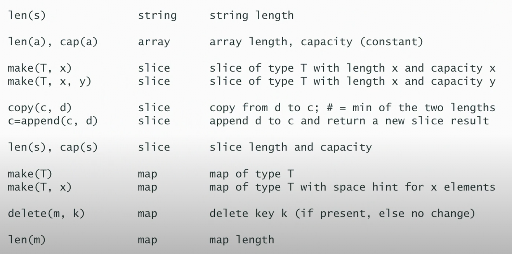

# Initial Videos - The Basics
## Variables
- Variables are defined with the `var` keyword or the shorthand `:=` (only inside of functions / methods to simplify parsing!).

```go
var a int
// or
a := 2 // in functions or methods
```

- Fun Printf snippet - `%d %[1]v` will _reuse_ the first passed in argument (e.g. if we want to print a single variable twice in a Printf, you'd normally do `fmt.Printf("%d %d", a, a)`, but with this you just need to do `fmt.Printf("%d %[1]v", a)` and that parameter `a` will be reused)
- Only numbers, strings or booleans can be constants

```go
const(
    a = 1
    b = 3 * 100
    s = "hello"
)
```

## Strings
- `byte` is a synonym for `uint8`
- `rune` is a synonym for `int32` for characters 
- `string` is an _immutable_ sequence of "characters"
  - Logically a sequence of unicode `runes`
  - Physically a sequence of bytes (UTF-8 encoding)
- We can do raw strings with backticks (they don't evaluate escape characters such an `\n`)

```go
`string with "quotes"`
```

- IMPORTANT: The length of a `string` is the number of UTF-8 bytes required to encode it, NOT THE NUMBER OF LOGICAL CHARACTERS
- Internally strings consist of a length (remember that they are immutable) and a pointer to the memory where the string is stored. Since the _descriptor_ contains a length, no null byte termination is needed (as is the case in C)
- Strings are passed by reference
- The `strings` package contains useful string functions

## Arrays and Slices
- Arrays have fixed size, slices are variable size
- Slices have a backing array to store the data; slice _descriptors_ (not an official thing - just used to denote the underlying logic of this data) have a length (how many things in the slice), a capacity (the capacity of the underlying array) and a pointer to the underlying array
- Slices are passed by reference, but you can modify them unlike strings
  - Arrays are passed by value 
- Arrays are also comparable with `==`, slices are obviously not. Arrays can be used as map keys, slices cannot
- Slices have `copy` and `append` helper operators
- Arrays are used almost as pseudo constants

## Maps
- Maps are implemented using a hash table
- When you try to read a key that doesn't exist, you receive the default value of the map value type (e.g. for an `int` you'd get 0)
- You can also read from nil (uninitialised) maps, again will return the default value for any key

```go
var m map[string]int // nil map (reading any key will return the default value of the map value type)
_m := make(map[string]int) // empty non-nil map
```

- `make` creates the underlying hash table and allocates memory etc. It is required to instantiate and write to a map
- Maps are passed by reference, and the key type must have == and != defined (so the key cannot be a slice, map or function)
- Map literals are a thing:

```go
var m = map[string]int {
  "hello": 1
}
```

- Maps can be created with a set capacity for better performance
- Maps also have a two-result lookup function:

```go
p := map[string]int{} // Empty non nil map
a, ok := p["hello"] // Returns 0, false since the key "hello" doesn't exist
p["hello"]++
b, ok := p["hello"] // Returns 1, true

if w, ok := p["the"]; ok {
  // Useful if we want to do something if an entry is / isn't in the map
}
```

- **Important:** you cannot take the address of a map entry (e.g. like `&myMap["Hello"]`)
  - The reason for this is the map can change its internal structure and the pointers to entries are dynamic so it is very unsafe to reference a map entry 

## Various Builtin Functions
<figure>

<figcaption style="font-style: italic;">
Reproduced from <a href="https://www.youtube.com/watch?v=T0Xymg0_aSU">https://www.youtube.com/watch?v=T0Xymg0_aSU</a>
</figcaption>
</figure>

## `nil` (From [https://www.youtube.com/watch?v=ynoY2xz-F8s](https://www.youtube.com/watch?v=ynoY2xz-F8s))
- `nil` indicates the absence of something, with part of the Go philosophy being to make the zero value useful
- The length of a nil slice is 0, you can read a map that doesn't exist - any key returns the default value. These features reduce code noise / boilerplate
- The `nil` value has no type; it is defined for the following constructs:
  - Nil pointer -> the zero value for pointers - points to nothing
  - Nil slice -> a slice with no backing array (with zero length and zero capacity)
  - Nil channels, maps and functions -> these are all pointers under the hood so a nil [channel,pointer,function] is just a nil pointer

### Nil Interfaces
- Nil interfaces -> I still don't fully understand this but interfaces internally have two things - the type of the value inside and the value itself

```go
var s fmt.Stringer   // This is a nil interface with no concrete type and no value (nil, nil)

fmt.Println(s == nil)   // Will print true since (nil, nil) == nil

//---

var p *Person // This Person satisfies the person interface

var s fmt.Stringer = p // Now we have (*Person, nil) - a concrete type (*Person) but still no value. This is now no longer equal to nil

//---

func do() error { // This will return the nil pointer wrapped in the error interface (*doError, nil)
  var err *doError
  return err // This is a nil pointer of type *doError
}

fmt.Println(do() == nil) // Will be FALSE because of the above example - (*doError, nil) != nil!!!

// It is good practice to not define or return concrete error variables
``` 

## Control Statements
- If statements require braces
- We can have a short declaration in an if statement to simplify logic:

```go
if x, err := doSomething(); err != nil {
  return err  
}
```

- Only for loops exist in Go, no do or while
- We can do ranged for loops for arrays and slices:

```go
for i := range someArr {
  // i is an index here. Remember this - this mistake can happen often. i is the INDEX NOT THE VALUE. 
  // If you want to range over the values you can use the blank identifier like for _, v := range someArray
}

for i, v := range someArr {
  // i is an index, v is the value at that index
  // The value v is COPIED - don't modify. If the values are some large struct, it might be better to use the explicit indexing for loop
}

for k := range someMap {
  // Looping over all keys in a map
}

for k, v := range someMap {
  // Getting the keys and values in the loop
}
```

- Remember maps in Go have no order since they are based on a hashtable
  - To run through a maps values in key order, the keys must be extracted, sorted, then looped over to index into the map
- An infinite loop can be started with an empty for:

```go
for {
  // Infinite loop
}
```

- Switch statements are syntactic sugar for a series of if-then statements

```go
switch someVal {
  case 0,1,2:
    fmt.Println("Low")
  case 3,4,5:
    // Noop
  default:
    fmt.Println("Other")
}
```

- Cases break automatically in Go - no break statement is needed 
- There is also a switch on true statement which is used to make arbitrary comparisons:

```go
a := 3

switch {
  case a <= 2:
  case a == 8:
  default:
    // Do something
}
```

- It's basically just a bunch of if statements, evaluated in the order they are written

## Packages
- Every standalone program in Go must have a `main` package
- There are two main scopes in Go; package scope and function scope
- You can declare anything at package scope but you can't use the short declaration operator `:=`
  - This is to make the program easier to parse since every statement at the top level has a keyword (e.g. const, var, type, func etc.)
- Packages break the program down into independent parts
- Anything with a capital letter is exported 
- Within a package, everything is visible (even across multiple files - you can have multiple files under the same package)
- There is a standard library in Go with lots of useful features. There is also an "extension" to the standard library (e.g. for a package like "golang.org/x/net/html") that offers less stable packages that might be candidates for the standard library in the future.

## Imports
- Go imports are based on necessity, if an import isn't used within a file then it is a syntax error
- Go understandably doesn't allow circular imports
- There is an `init()` function for a package, however using this isn't really recommended
- *Packages should embed complex behaviour behind a simple API*

## Variable Declarations
- Using the `var` keyword

```go
var a int
var a int = 1
var c = 1       // Type inference
var d = 1.0

// Declaration block for simplicity
var (
  x, y int
  z    float64
  s    string
)
```

### Short Declaration Operator `:=`
- The short declaration operator `:=` is used to declare and assign to a variable
- It can't be used outside of functions (to allow for faster parsing of a program)
- It must declare at least one new variable:

```go
err := doSomething()
err := doSomethingElse() // This is wrong, you can't re-declare err
x, err := doSomethingOther() // This is fine since you are declaring the new var x, and just reassigning err from the original assignment on the skip line above
```

- The caveat to that final point is that we _can redeclare (shadow) to variables in an outer scope_
  - When using a short declaration in a control structure (e.g. `if _,err := do(); err != nil`), that err declaration is local to the control structure scope (that if block scope). 
- See example for a gotcha:

```go
func do() error {
  var err error

  for {
    n, err := f.Read(buf)

    if err != nil {
      break
    }

    doSomething(buf)
  }

  return err
}
```

- The mistake here is that the err in the for loop is of an inner scope, it shadows the one defined in the function scope above, and is lost when the for loop exits. Thus returning the err in the last line will _always be nil_ 

### Typing
#### Structural and Named Typing
- Structural typing is based on the structure of a variable. Some examples of things with the same type:
  - Arrays with the same base type _and_ size
  - Slices with the same base type
  - Maps with the same key _and_ value types
  - Structs with the same sequence of field names and types
  - Functions with the same typed parameters and return types
- Named typing happens when you introduce a new custom type with the `type` keyword
  - Things are only the same type when they have the same declared named type, so declaring `type x int` means that you can't assign something with type `x` to `int` or vice versa, you would have to use a type conversion like `var thing x = x(12)`
- Integer literals are untyped - they can assign to any size integer without conversion, and can be assigned to floats, complex etc.
- The only overloaded operator in Go is the + operator to concatenate strings