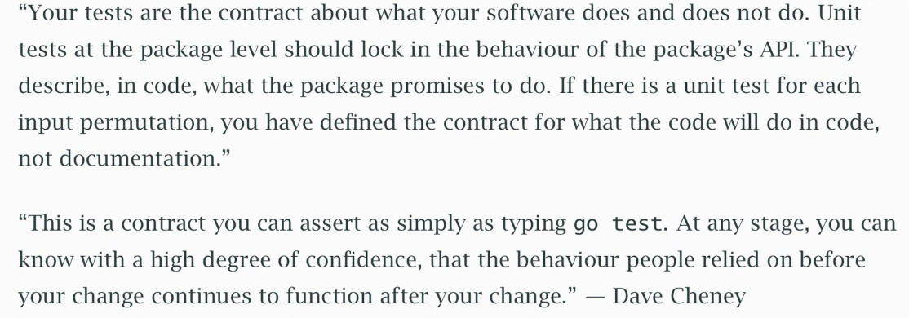

## Testing (Video 38)
- Go conventions are for files ending in `_test.go` for test files, holding `TestXXXX` functions (this is similar to the `BenchmarkXXXX` functions for benchmarking)
- Tests are run with `go test`
  - Tests aren't run if the source wasn't changed since the last test

### Layers of Testing
- There are different layers of testing that can be done by developers and testers
- From the top down, we have different types of testing, with the line being drawn somewhere in *end-to-end* between that which is done by testers and that which is done by developers
  - Chaos testing
  - System testing
  - Performance / load testing
  - End-to-end testing
  - Integration testing
  - Unit testing
- Testing at the developer level can cover many different things:
  - Extreme values
  - Input validation
  - Race conditions
  - Error conditions
  - Boundary conditions
  - Pre and post conditions
  - Randomised data (fuzzing)
  - Configuration and deployment
  - External interfaces to other software
- Developer testing is transparent and fully automated; as developers we know stuff about the software that we can test

### Test Functions
- Test functions have the same signature:

```go
func TestCrypto(t *testing.T) {
  // do some tests

  if err != nil {
    t.ErrorF("failed test: %s", err)
  }
}
```

- `testing.T` is something you can report errors on

### Subtests
- We can run subtests under a parent using `t.Run()`

```go
func SomeTest(t *testing.T) {
  table := []struct {
    name string
    param int
    outcome int
  }{
    {name: "test1", param: 1, outcome: 10},
    {name: "test2", param: 3, outcome: 30},
  }
}

for _, st := range table {
  t.Run(st.name, func(t *testing.T) {
    // do the test here
  })
}
```

- Now we can have nice named subtests parameterised

#### Nicer Subtest / Parameterised Testing Pattern
- These functions can become a bit cumbersome, so an approach was outlined in the video that looks as follows:

```go
// this is the function we are testing
func someFunctionToTest(input string) bool {
  return len(input) < 5
}

// we define a named type for our parameterised test
type parameterisedTest struct {
  name  string
  input string
  want  bool
}

// we define a run method which we use as our input to t.Run
func (pt parameterisedTest) run(t *testing.T) {
  got := someFunctionToTest(pt.input)
  if pt.want != got {
    t.Errorf("input %v, wanted %v, got %v", pt.input, pt.want, got)
  }
}

// we define our table of tests
var tests = []parameterisedTest{
  {name: "happy", input: "hi", want: true},
  {name: "boundary 1", input: "hello", want: true},
  {name: "boundary 2", input: "helloo", want: false},
}

// now everything is nicely separated in our actual test and is easier to follow
func TestSomeFunctionToTest(t *testing.T) {
  for _, pt := range tests {
    t.Run(pt.name, pt.run)
  }
}
```

- `pt.run` is a method value! It's the run method bound to `pt` which is the particular parameterised test we are running!
- Super neat pattern!!!

#### Checker Refactoring for Subtests
- We can also parameterise how we check results using a checker interface:

```go
type checker interface {
  check(*testing.T, string, string) bool
}

type subTest struct {
  name string
  shouldFail bool
  checker checker
}

type checkGolden struct { /*...*/ }

func (c checkGolden) check(t *testing.T, got, want string) bool {
  // implement checking logic here
}
```

### Mocking / Faking
- We can define mocks / fakes for things like database interfaces

```go
type DB interface {
  GetThing(string) (string, error)
}

var errShouldFail = errors.New("db should fail")
type mockDB struct {
  shouldFail bool // our mock DB can have forced fail scenarios for testing
}

func (m mockDB) GetThing(key string) (string, error) {
  // mockDB now conforms to the DB interface
  if m.shouldFail {
    // we can force an error case when the flag is set
    return thing{}, fmt.Errorf("%s: %w", key, errShouldFail)
  }
}
```

- We can use things like in-memory Redis things for testing, whereas for things like Postgres it's less easy to have an in-memory version because of the complexity of the implementations

### `TestMain`
- `TestMain` and `testing.M` is a way of doing initialisation before running tests, e.g. spinning up a database

```go
func TestMain(m *testing.M) {
  // setup
  setupDatabase()

  // run tests
  rc := m.Run()

  // teardown
  teardownDatabase()

  os.Exit(rc)
}
```

- Tests will be run when `m.Run()` is explicitly invoked
- Make sure to perform teardown explicitly before calling `os.Exit()`, don't `defer` since defers don't run after `os.Exit()` is called

### `t.Cleanup`
- `t.Cleanup` is a function used to unregister resources created for a test, an alternative to tearing down in `TestMain`

```go
func TestSomething(t *testing.T) {
  dir := os.MkdirTemp("", "x")
  t.Cleanup(func() { os.RemoveAll(dir) }) // register cleanup function
  // test uses dir...
}
```

- Semantically `t.Cleanup` registrations are similar to `defer` except they are preferred since from inside helper functions, a `defer` would run after the helper is called rather than after the test has completed:

```go
func newServer(t *testing.T) *Server {
  s := startServer()
  t.Cleanup(func(){ s.Close() }) // register cleanup in helper
  return s
}

func TestDoStuff(t *testing.T) {
  s := newServer(t)
  // use s - cleanup happens after test completes
}
```

### Test-only Packages
- Sometimes we want to test a package only from an external interface standpoint; for opaque or *black-box* tests
- Normally tests will run inside the same package as what they are testing, meaning they get access to internal names
- Creating a separate test package that ends in `_test` will mean you only have access to exported names (functions, constants, structs etc.) from your package
  - This means you can do black-box testing

### Philosophy of Testing

<figure>

<figcaption style="font-style: italic;">
Reproduced from <a href="https://www.youtube.com/watch?v=PIPfNIWVbc8">https://www.youtube.com/watch?v=PIPfNIWVbc8</a>
</figcaption>
</figure>

- Unit tests are about defining the behaviour of a package's API; they define a contract for behaviour concretely rather than potentially incorrectly like documentation
- Well written tests will allow for a high degree of confidence that an API's behaviour is still correct after some change
- Assume code doesn't work unless:
  - You have tests (unit, integration etc.)
  - They work correctly
  - You run them
  - They pass
- This is just basic code hygiene; start clean - stay clean
- Developer testing is necessary and important - developers should aim for 75%+ coverage, through unit tests, integration tests and post-deployment sanity checks
- Tests can also be part of your documentation if written well

<figure>

<figcaption style="font-style: italic;">
Reproduced from <a href="https://www.youtube.com/watch?v=PIPfNIWVbc8">https://www.youtube.com/watch?v=PIPfNIWVbc8</a>
</figcaption>
</figure>
