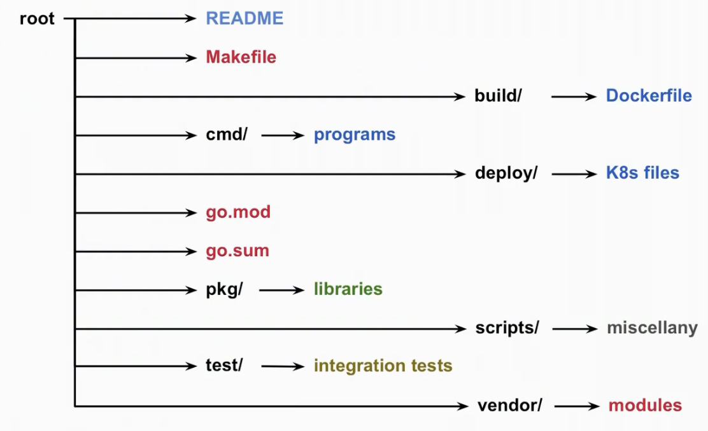

## Building Go Programs (Video 41)
- `go build` builds a binary
- `go install` moves this binary to `$GOPATH/bin`

### Pure Go Programs
- Sometimes it's useful to build a binary with no dependencies, including system dependencies like `libc`; producing an executable with no linked dependencies
- We can do this with a combination of flags (although these flags do change and there is no all-encompassing single flag yet)

```bash
CGO_ENABLED=0 go build -a -tags netgo,osusergo -ldflags "-extldflags '-static' is -w" -o a.out .
```

- These binaries are interesting since they can be put into an empty Docker container (e.g. without `libc` or other runtime dependencies)

### Cross Compilation
- Go is cross-compilation ready out of the box; you define `$GOARCH` for your architecture (e.g. `amd64`, `arm64`), `$GOOS` for the OS you want (e.g. `linux`, `darwin`) and `$GOARM` specifically for the ARM chip version (e.g. `7`)
- For example, to build a fully static binary for the Raspberry Pi, we can do:

```bash
GOOS=linux GOARCH=arm GOARM=7 CGO_ENABLED=0 go build -a -tags netgo,osusergo -ldflags "-extldflags '-static' -w" -o a.out ./main.go
```

- This is a very powerful feature of Go

### Project Directory Layout

<figure>

<figcaption style="font-style: italic;">
Reproduced from <a href="https://www.youtube.com/watch?v=rXgUP_BNyaI">https://www.youtube.com/watch?v=rXgUP_BNyaI</a>
</figcaption>
</figure>

- The image above shows a standard directory layout for a Go project
- `cmd/` is used for the main executable program
- `pkg/` is used for any custom libraries
- `test/` is for any separate integration tests
  - Most of the time for unit tests we have `package_test.go` stored with the package itself in the same directory

### Readme Best Practice
- A good readme contains:
  - A project overview
  - Developer setup 
  - Project structure
  - Dependency management
  - How to build and install
  - How to run tests
  - How to run locally or in Docker etc.
  - Database and schema definitions
  - Credentials and security
  - Debugging and monitoring information
  - CLI tools and their usage

### Makefiles
- It's good practice to package Go build directives in a Makefile
- One useful practice is to have a makefile variable be a version pulled from git, which can then be injected into the Go program at build time using `-ldflags "-X main.version=$(VERSION)"`, with a variable defined like `VERSION=$(shell git describe --tags --long --dirty 2>/dev/null)`
  - It isn't a good idea to put a build timestamp in your executable since a build process should be fully reproducible

### Go and Docker
- Multi stage build are a powerful way of building Go programs
  - The idea is that we have a first stage that builds the binary in one container, then copy only what we need into a second container, containing nothing else but our Go program and any other required things like certificates
- See video / Github for multi stage build example with Docker, it's quite cool!
