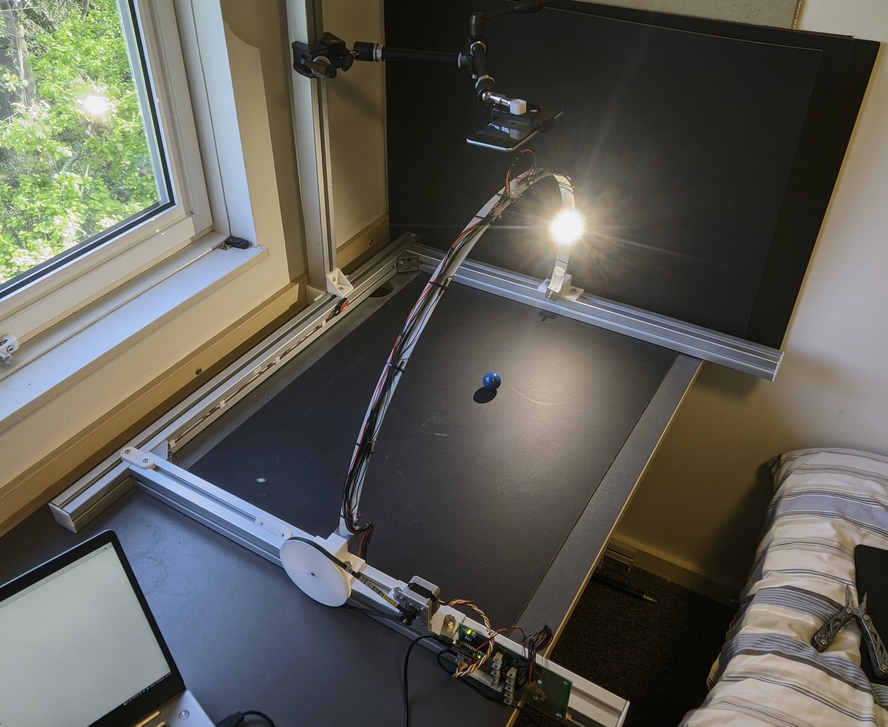
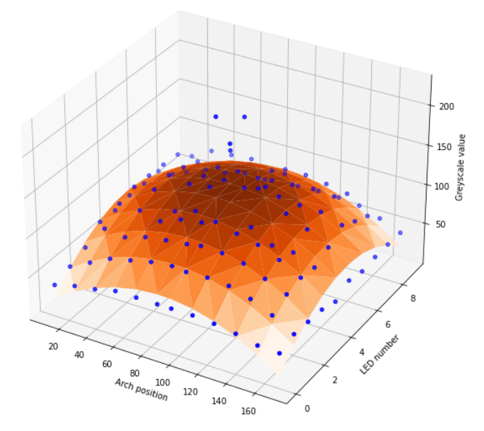

# About Me
I am Alex, a First Class Honours BSc Computer Science Graduate (79.5% average). 

## Third Year Project
- Designed and implemented a robotically controlled arch for dataset generation in Reflectance Transformation Imaging
  - Mechanical design of the system
  - Electronics design of the controller
  - With a focus on reducing cost and encouraging reproducibility
- Implemented the Polynomial Texture Mapping algorithm using a novel higher order multinomials technique

<figure>

<figcaption style="font-style: italic;">
</figcaption>
</figure>

<figure>

<figcaption style="font-style: italic;">
Biquadratic modelling (orange) of pixel response values (blue)
</figcaption>
</figure>

## Other Things
- In 2021 I gave a talk to my University's Cybersecurity society on an introduction to hardware hacking; slides can be found [here](https://github.com/0x416c6578/0x416c6578.github.io/blob/master/other/files/SUCSS_Introduction_to_Hardware_Hacking.pdf).

# University Modules
## Optional University Modules
### Year 3
- Computer Vision
  - Varied mix of traditional and modern computer vision techniques
  - Point and group operators, edge detection, feature extraction, machine learning for computer vision, PCA
- Foundations of Machine Learning
  - Mathematics underpinning machine learning algorithms, probability, regression and classification, PCA
- Robotic Systems
  - Kinematics (forward and inverse), robot configurations, trajectory generation, sensors, computer vision and bio-inspired robotics
- Security of Cyber Physical Systems
  - Low level details of the Trusted Platform Module
  - Using machine learning to detect pricing manipulations in a smart grid
- Natural Language Processing
  - Regex, classical NLP techniques, neural NLP techniques (RNNs, GRUs, Transformers)
### Year 2
- Computer Systems II 
  - Focus on AVR hardware, scheduling, MMIO, security of embedded hardware
  - LCD graphics library project can be found [here](https://github.com/0x416c6578/lafortuna-lcd-mirror)

## Core University Modules
- Programming I (intro to OOP)
- Foundations of Computer Science (mathematical fundamentals to an array of CS topics)
- Computer Systems I (high level overview of CPU architecture, bits and bytes, electronics basics)
- Software Modelling (formal modelling and verification)
- Programming II (more Java OOP)
- Algorithmics (algorithms and datastructures)
- Data Management (Relational model and SQL, Git, Unix)
- Intelligent Systems (classical machine learning algorithms)
- Interaction Design
- Theory of Computer Science (time and space complexity, determinism etc.)
- Programming III (functional programming in Haskell)
- Distributed Systems and Networks (TCP/IP, distributed algorithms, Java networking)
- Programming Language Concepts (execution model, lexing, parsing, programming language design)
- Software Engineering Group Project (semester-long project using agile methods)