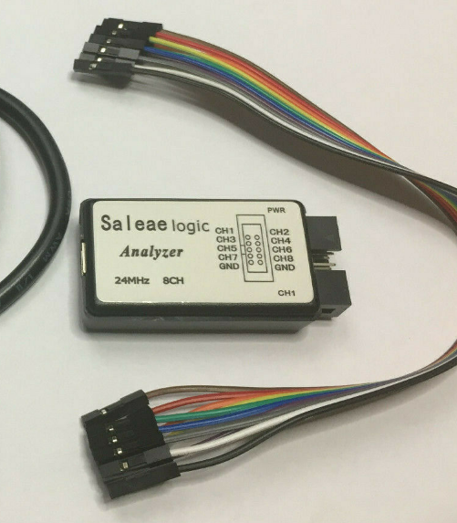
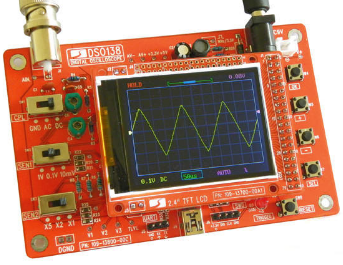
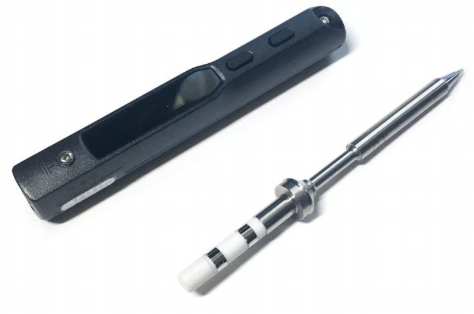

# Stuff I Use / Recommend
- Knockoff Saleae logic analyzer (£10ish on Ebay or AliExpress) - very useful for visualisation of digital signals

<figure>

<figcaption style="font-style: italic;">
</figcaption>
</figure>

- DSO138 cheapo oscilloscope - useful for lowish frequency analog stuff

<figure>

<figcaption style="font-style: italic;">
</figcaption>
</figure>

- TS100 soldering iron - very good soldering iron for the price

<figure>

<figcaption style="font-style: italic;">
</figcaption>
</figure>