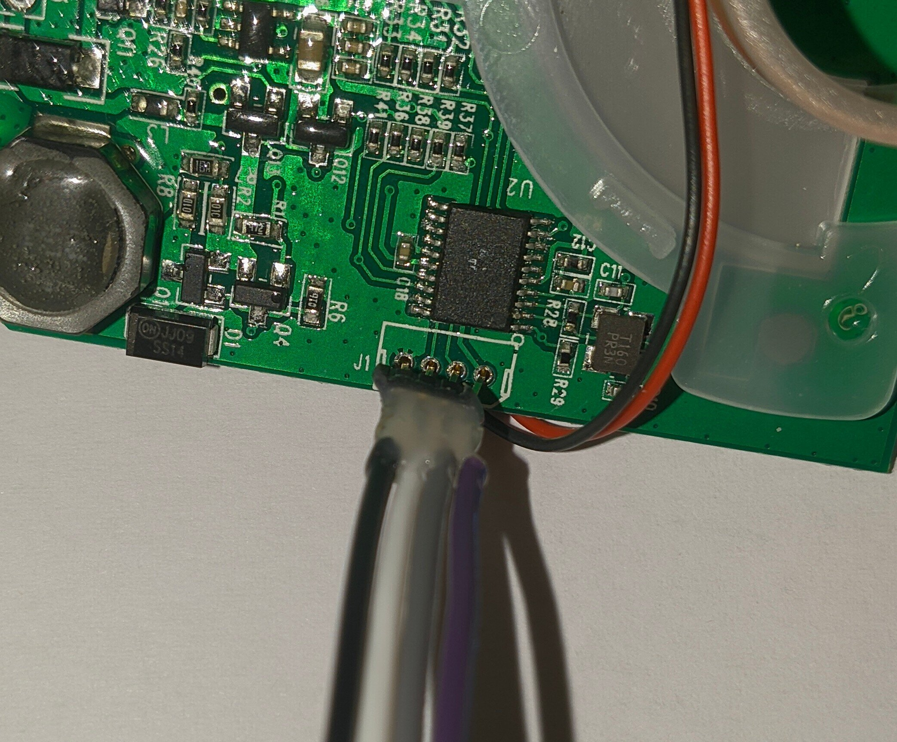

# (Mis)adventures With the LDS-006 Lidar
## Starting Out
The LDS-006 is a very cheap 360 degree Lidar module that you can buy on Aliexpress. I bought one because I thought the £13 price was too good to be true for a type of module that tends to cost over £50. The listing seemed to say they were salvage pieces from Ecovacs Deebot robot vacuum cleaners, but when it arrived it looked brand new. The listing had almost no information about the module, however I assumed it talked serial like some other modules I had seen before.

<figure>

<figcaption style="font-style: italic;">
</figcaption>
</figure>

<figure>

<figcaption style="font-style: italic;">
</figcaption>
</figure>

The first thing I did was try to hook it up via serial. Having seen an "LDS-Piccolo" referenced in a [Marco Reps](https://www.youtube.com/user/reppesis) video, I thought it would just start spewing out data, however no data came, and the motor didn't start spinning, so I knew I needed to do more work.

My first test was to see if the thing was actually working, so I hooked up a ammeter and it showed a 400mA draw, which was on spec. I then shoved my phone camera into the laser and saw a bright purple spot indicative of an IR emission. So clearly the spinny part was doing something, but I still needed to know more about what I was dealing with.

## The Internals
The module is designed similarly to other Lidar modules, with the power being inductively coupled up to the spinning part, and data being sent back via an IR LED and receiver. The spinning part houses an IR laser and receiver/sensor, with a GD32F\[something\] microcontroller handling all the fancy laser control and measurement stuff. The bottom board contains another GD32F130 microcontroller, and rather a lot of passives (compared to the Xiaomi lidar that Marco Reps showed in his video). The motor control is done via PWM on pin PA4 of the chip (which just runs over to a MOSFET to drive the DC motor). PA2 and PA3 go out to the connector, as they are the USART1 TX and RX pins respectively. The UART is __NOT 5V TOLERANT__ (according to the datasheet), although I accidentally shoved 5v through it and it still worked fine after. This means that the blue wire is UART TX, and the green is UART RX.

<figure>

<figcaption style="font-style: italic;">
</figcaption>
</figure>

Inside the spinning part there is a photoelectric fork sensor that detects when and how fast it is spinning.

There is an SWD debug port next to the microcontroller. The pinout is GND->SWCLK->SWDIO->3v3 (from left to right on the image below), and it works fine with an ST-Link v2 clone I had lying around (more on this later).

<figure>

<figcaption style="font-style: italic;">
</figcaption>
</figure>

## Data!
After sussing out some of the internals, I decided to give it another try over serial. The serial setup is standard everything @ 115200 baud. After an hour or so of trying different settings, voltages, pullups and pulldowns etc, I had got nowhere. I tried spamming letters and symbols into my picocom prompt in frustration, and suddenly data started spewing out! It turns out it will start sending data upon receiving the character `$`. That was the only interaction I found you could do with the module. It would send back `!` upon receiving `$` but no amount of spamming (and `cat`ting `/dev/urandom` into it!) could cause any other behaviour.

<figure>

<figcaption style="font-style: italic;">
</figcaption>
</figure>

The data seemed to be repeating packets starting with `0xFA` which matched some of the very limited [online resources](https://github.com/getSurreal/XV_Lidar_Controller) I found. The packets are sent 6 times, and they are only sent when the spinning part spins (this again is similar to other modules). However there was still a big flaw, in that the motor still wasn't spinning. This had me worried because I thought maybe I still hadn't initialised the thing properly (coupled with the fact there was only 3 bytes of variation between different packets, that made me think it wasn't actually sending distance / speed data). So I decided to do more digging.

## Debugging Woes
As mentioned earlier, there is an SWD port exposed to the world next to the microcontroller. I wanted to try and get more information about, and potentially reverse engineer and patch the serial comms code, so dumping the flash was a necessity. Connecting it up to an ST-Link v2 clone, I tried interfacing with `openocd`. After an hour or so of debugging (and figuring out I had the connector orientation the wrong way round despite checking at least 5 times!), I finally got OpenOCD working, and I had a debug terminal open. For reference the command was:
```bash
openocd -f /usr/share/openocd/scripts/interface/stlink.cfg -f /usr/share/openocd/scripts/target/stm32f1x.cfg
# Then just telnet to localhost on port 4444
```
I could halt the CPU, set breakpoints and so-forth, however for some reason I kept getting read errors when trying to read out the flash. I was 99% sure I was doing everything right, and after another hour or so of checking, I was 99.9% sure. I would get a `-4` return code and a `"Read error"` from OpenOCD, but there wasn't really any information online, and I also couldn't find much in a cursory look through the OpenOCD source. I then made the fatal mistake of trying to unlock the flash (even though it was already unlocked) to try and fix the weird read errors. This command worked fine, however I instantly knew I had f'd up when I saw the current draw dropped from 400mA to 1.8mA after a reset.

The thing was borked. I had cleared the flash in an attempt to unlock it (again it was **already unlocked!!!**), and it wouldn't respond over serial anymore. I then tried reading a single byte out of flash (something I had only tried once or twice before), and it said `0xff`, confirming my suspicions of a wiped flash.

After more messing about, I realised I could actually read out all the data fine. It turns out it would randomly fail reading due to (perhaps) a bad connection via SWD, so my attempts to read the flash out before were just bad luck byzantine failures. Of course when I attempted to read the (now cleared) flash out, it eventually worked after about 20 attempts. So if I had just attempted to read the flash out a bunch of times __before__ wiping it, I would have had a successful dump.

Now I am stuck with a fancy paperweight, a 32kb file of `0xff`s, and many regrets, until a new one arrives in about a months time and I can dump the flash from it and re-program the broken one...