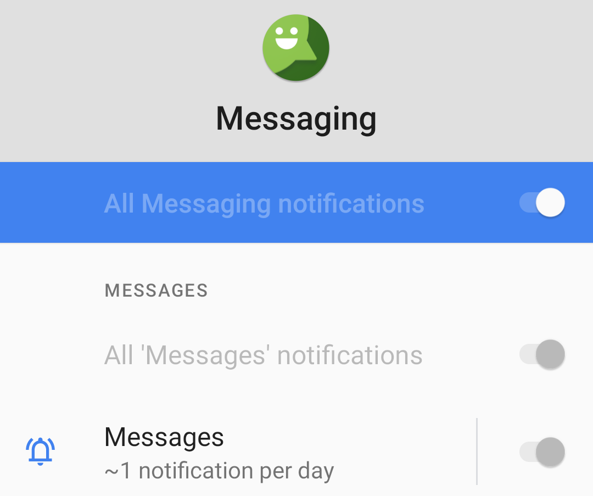
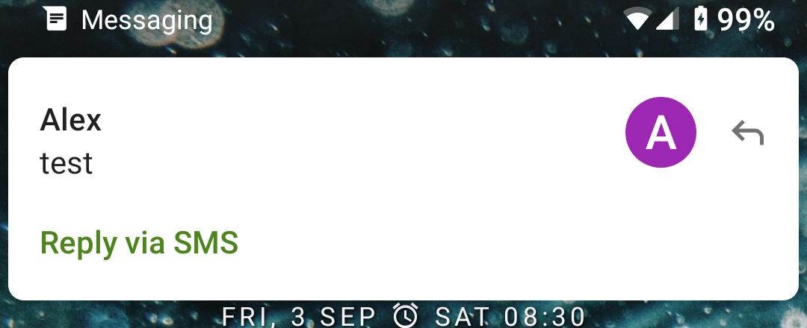

# Fixing Android Messaging Notifications
## The Problem
For the most part Android is a great mobile OS. I have used deGoogled LineageOS for about the past year and a half, and have been very happy with it. However one major problem with it that I found is that you can't change the notification settings for system apps.

<figure>

<figcaption style="font-style: italic;">
</figcaption>
</figure>

Unfortunately messaging notifications channels are setup with the default priority, meaning that by default they won't appear as a "heads up" notification (offending line `NotificationManager.IMPORTANCE_DEFAULT"` [here](https://github.com/LineageOS/android_packages_apps_Messaging/blob/07958b86402884895e2e19a9c9ded5f5944b3d58/src/com/android/messaging/datamodel/BugleNotifications.java#L945)):

<figure>

<figcaption style="font-style: italic;">
</figcaption>
</figure>

By default system apps can't have their notification settings changed (I assume so that important notifications can't be disabled accidentally by the user), but I feel like that is too restrictive (maybe just specific system apps should be blocked).

## Attempts To Fix
### Config File
My first attempts to fix this problem were to look for where notification settings were stored. A quick DuckDuckGo revealed they were stored in `/data/system/notification_policy.xml`, with each app having its own `package` tag with notification channels defined in them.

```xml
<package name="com.android.messaging" show_badge="true"...>
  <channelGroup id="conversation_group" name="Messages".../>
  <channel 
    id="messaging_channel" 
    name="Messages" 
    importance="3" 
    priority="2" 
    sound="content://settings/system/notification_sound" 
    usage="5" 
    content_type="4" 
    flags="0" 
    lights="true" 
    vibration_enabled="true" 
    locked="153" 
    show_badge="true" 
    group="conversation_group" s
    orig_imp="3" />
</package>
```

I decided to see how this data would react when changing notification settings, so I used another app and changed its settins whilst watching how this file was updated. I found that `importance` for a channel would update from `3` to `4` when enabling the _"Pop on screen"_ (heads up) setting. I also saw the `locked` field, and my first experiment was to try changing that.

Making sure I was user `system` with `su system`, I edited the `locked` field to `0`, and saved the file. This unfortunately didn't unlock the channel options, since I think Android rolls back the file if it is changed without going through the proper means (using the `NotificationManagerService` - [source](https://cs.android.com/android/platform/superproject/+/master:frameworks/base/services/core/java/com/android/server/notification/NotificationManagerService.java?q=notification_policy.xml)). Also changing the value of `importance` wasn't persistent, even after rebooting right after.

### Trying Android `service` Command

My next attempt was to use the Android `service` command to try and change the settings. I found [this](https://android.stackexchange.com/questions/34625/where-to-find-description-of-all-system-bin-service-calls) helpful SO answer, and proceeded to use `INotificationManager.aidl` (source [here](https://cs.android.com/android/platform/superproject/+/master:frameworks/base/core/java/android/app/INotificationManager.aidl)) with the `service` command over ADB to mess with stuff:

___

Using method `10` from `INotificationManager.aidl` - `boolean canShowBadge(String pkg, int uid)`, with notification badges for messaging turned off in the Android settings app
```
OnePlus5T:/ # service call notification 10 s16 "com.android.messaging" i32 10139
  Result: Parcel(00000000 00000000   '........')
```
Now I enabled notification badges, and re-called the method; see the return value of `1` - badges are now enabled
```
OnePlus5T:/ # service call notification 10 s16 "com.android.messaging" i32 10139
  Result: Parcel(00000000 00000001   '........')
```

___

After flicking through `INotificationManager.aidl`, I found no method to set the `importance` of a channel, and more experimentation and source code exploration didn't yield a simple solution, so I had pretty much hit a dead end. I reckon I could have found a solution using this method, had I not found a much easier working solution detailed below.

## The Solution
It turns out the config file approach would work fine, the only problem was I was editing the file whilst in a fully running Android environment (so the changes to the file were rolled back). The solution was to boot into recovery and edit the file, then clear cache and ART cache (I'm not sure if this was needed or not), then after rebooting, the settings were read from the file successfully; thus heads up notifications were enabled!

<figure>

<figcaption style="font-style: italic;">
</figcaption>
</figure>

You can see the settings is still locked (unable to change it), however the toggle is enabled; and now `com.android.Messaging` has heads up notifications.

<figure>

<figcaption style="font-style: italic;">
</figcaption>
</figure>

___

### Links
- <https://cs.android.com/> - very nice tool to search quickly though the Android sources
- <https://developer.android.com/training/notify-user/channels> - info about notification channels
- <https://cs.android.com/android/platform/superproject/+/master:frameworks/base/services/core/java/com/android/server/notification/NotificationManagerService.java> and <https://cs.android.com/android/platform/superproject/+/master:frameworks/base/core/java/android/app/INotificationManager.aidl> - files I found most useful to understand the internals of Android notifications
- <https://github.com/LineageOS/android_packages_apps_Messaging/blob/lineage-18.1/src/com/android/messaging/datamodel/BugleNotifications.java#L945> - offending line in `com.android.Messaging` that disabled heads up notifications