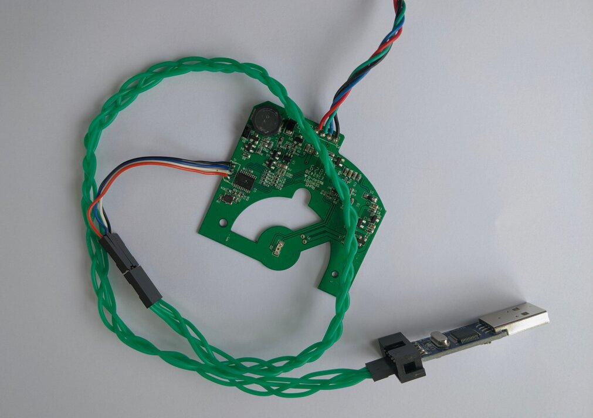
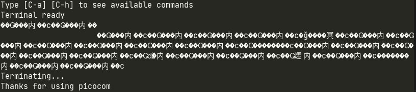
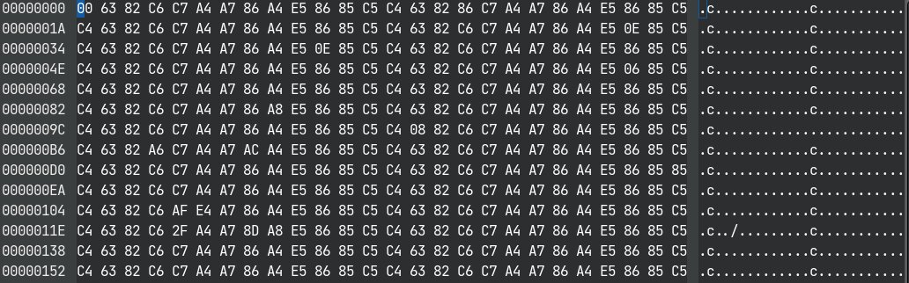
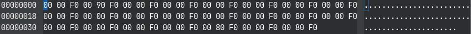
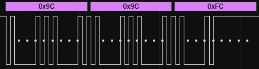
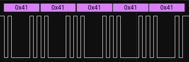
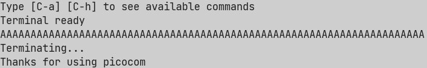
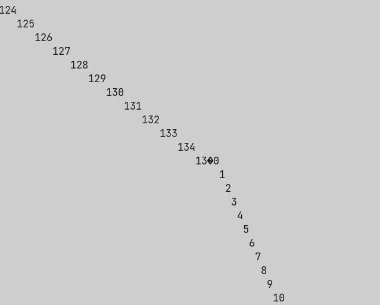

# More LIDAR Stuff - Messing with the GD32F130F6P6
Since I had a "bricked" LDS-006 with no firmware on the data RX board, I decided to try and write some new firmware for it. This was to prove or disprove some of my assumptions on how the board works, and to eventually maybe write my own full firmware that could handle the incoming data from the spinny part, and then write it out over serial (in a nicer format). The IC used in the receiver board is the [GD32F130F6P6](https://www.gigadevice.com/microcontroller/gd32f130f6p6/), a knockoff of the STM32F103 but with a few extra features (namely an extra read-protection mode, see [here](https://www.usenix.org/system/files/woot20-paper-obermaier.pdf) for info).

Some DuckDuckGo'ing led me to [this repo](https://github.com/maxgerhardt/pio-gd32f130c6), which was for the GD32F130**C6**, however this and the F130F6P6 are very similar, the former just having more GPIO pins. I created a new board file for the F6P6 (see [~~here~~ **TODO**]() for project repo), and edited the stock `main.c` to just init and toggle one GPIO pin (PORTA GPIO14, since from the PCB it doesn't seem to be connected  to anything). I then successfully built a `firmware.bin` file with the PlatformIO VSCode extension, and I started up OpenOCD and tried flashing the file. Although it seemed to flash correctly, it didn't toggle the GPIO like I wanted (after a hard reset), and I then tried reconnecting over OpenOCD, but now it wouldn't connect to the target.

## Unbricking
So I was now worried that I had popped the chip, since I was probing around a lot, and could have easily shorted something out. More reading and examining the PCB led me to the `BOOT0` pin (pin 1 on the IC). I noted that it was pulled to ground via a resistor, which means that it will boot from internal flash. I then tried pulling the pin high, and as if by magic, OpenOCD now connected again :). I then did a mass erase, and thankfully the chip was then back in a working state.

**Note**: Pull the `BOOT0` pin to 3v3 if the chip isn't responding to OpenOCD; there are many connections going in and out of the chip, and potentially writing to random GPIO pins can soft brick the chip. When the pin is pulled high, do a mass erase in OpenOCD to get back to a known good state.

## Soldering to SWD
I would recommend soldering a 4-way wire to the SWD port, and adding connectors to the other end, since sticking 1mm pin headers into the holes isn't reliable, and can lead to accidentally shorting stuff.

<figure>

<figcaption style="font-style: italic;">
</figcaption>
</figure>


## Getting Code to Run
It turns out my first attempts to toggle a GPIO were working to some extent. Writing to a pin works with the following code, however timer based functions (for example `delay_ms()`) don't currently work.

```c
//Init CPU and write 1 to GPIO 4
int main(void) {
  systick_config();
  rcu_periph_clock_enable(RCU_GPIOA);
  gpio_mode_set(GPIOA,
                GPIO_MODE_OUTPUT,
                GPIO_PUPD_NONE,
                GPIO_PIN_4);
  gpio_output_options_set(GPIOA, 
                          GPIO_OTYPE_PP,
                          GPIO_OSPEED_50MHZ,
                          GPIO_PIN_4);

  GPIO_OCTL(GPIOA) = GPIO_PIN_4;
  for(;;) {}
  return 0; //never reached but for safety
}
```

## Trying to Fix the Clock
Looking around in the toolchain sources led me to `system_gd32f1x0.c`, which had the defines for the system clock config. I probed the working board with a logic analyzer to find that the external MEMS oscillator was running at 8MHz. I then set the correct clock variant (making sure `__HXTAL` was 8000000U), then recompiled. This didn't seem to fix my clock troubles but at least I think it is the correct option now.

```c
/* select a system clock by uncommenting the following line */
#define __SYSTEM_CLOCK_8M_HXTAL              (__HXTAL)
//#define __SYSTEM_CLOCK_8M_IRC8M              (__IRC8M)
//#define __SYSTEM_CLOCK_72M_PLL_HXTAL         (uint32_t)(72000000)
//#define __SYSTEM_CLOCK_72M_PLL_IRC8M_DIV2    (uint32_t)(72000000) [THIS LINE WAS ORIGINALLY UNCOMMENTED]
```

I also used the debugging feature a lot, which miraculously just worked (tm) with the VSCode extension. This allowed me to check that GPIO writes were working correctly (i.e. checking that the code was running at all), but still delay functions didn't work.

## Messing with USARTs
I then decided to copy over some of the code from the old `main.c` (from [here](https://github.com/maxgerhardt/pio-gd32f130c6/blob/master/src/main.c)) to init the USART1 (the same UART that is on the blue and green wires). The debugger shows that this code runs fine, and it even sends data over serial, but the data is corrupted? or at least I'm missing something. The data being sent is definitely uniform, but isn't the text that I am sending (_`"Hello world from serial"`_).

<figure>

<figcaption style="font-style: italic;">
</figcaption>
</figure>

<figure>

<figcaption style="font-style: italic;">
</figcaption>
</figure>

I think there is maybe a mismatch with baudrate, endianness? or some other misconfiguration on my end, because this definitely seems like well structured data. As an aside I set this to repeat every 1000ms, however it sends out the data every 400ish ms, so something is definitely wrong with the delay functions still.

I then set it up to output _`AAAAA`_, and the data it sent back was:

<figure>

<figcaption style="font-style: italic;">
</figcaption>
</figure>

This is clearly somewhat periodic, so I definitely think I am overlooking something. I will try more tomorrow.

___

## Update 11.9.21
As it turns out there was a timing problem; the oscillator on the PCB has the code T160, which I originally thought was 16MHz. When I used a logic analyzer it read 8MHz however I now think I had the sampling speed set too low, so it was aliasing perhaps? I used the logic analyzer to check the serial data, and it was actually being sent at a baud rate of twice the speed.

<figure>

<figcaption style="font-style: italic;">
</figcaption>
</figure>

We can see the data being sent is clearly not aligned with the async serial analyzer (purple). After setting the baud rate to 19200 in Saleae, we then get the correct data!

<figure>

<figcaption style="font-style: italic;">
</figcaption>
</figure>

So now I knew my original suspicion of a 16MHz crystal was correct. After passing `-DHXTAL_VALUE=16000000` as a compiler option in the PlatformIO config, the data is now at the correct baud rate of 9600MHz, and `picocom` gets the right data. This means that the internal clock is now working correctly.

<figure>

<figcaption style="font-style: italic;">
</figcaption>
</figure>

However, I put a delay of 4000ms in between the data packets, and I also alternated _`AAAAA`_ and _`BBBBB`_, however the packets were being sent about every 400ms still, and only _`AAAAA`_ was received, so for some reason either the delay function is crashing, or there is some interaction happening on the PCB that is causing the CPU to reset (this is of course a possibility since there are many connections to the CPU, so some might be doing things like resetting the power supply).

I ran the following code and it would reset, so clearly the delay function isn't the problem:

```c
char buf[20];
for(int i = 0; i < 10000; i++) {
  sprintf(buf, "%d\n", i);
  print_str(buf);
}
```

<figure>

<figcaption style="font-style: italic;">
</figcaption>
</figure>

Also when debugging, the CPU (I think) stays alive, so that rules out some sort of power supply issue (for reference I am now using the onboard 5v to 3v3 supply rather than the SWD 3v3 supply).

## [**Followup post**](009-GD32-Reset-Fix.md)

___

## Links

- <https://www.usenix.org/system/files/woot20-paper-obermaier.pdf> - paper on reading the flash of some chips
- <https://www.gigadevice.com/microcontroller/gd32f130f6p6/> - info page on GD32F130F6P6
- <https://github.com/maxgerhardt/pio-gd32f130c6> - cool repo for PlatformIO config
- <https://www.st.com/content/ccc/resource/training/technical/product_training/group0/c8/9e/ff/ac/7a/75/42/d1/STM32F7_System_RCC/files/STM32F7_System_RCC.pdf/jcr:content/translations/en.STM32F7_System_RCC.pdf> - info on stm32 reset controller