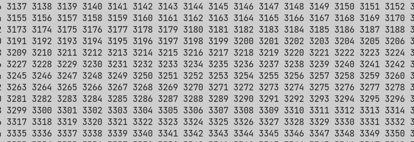
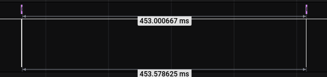
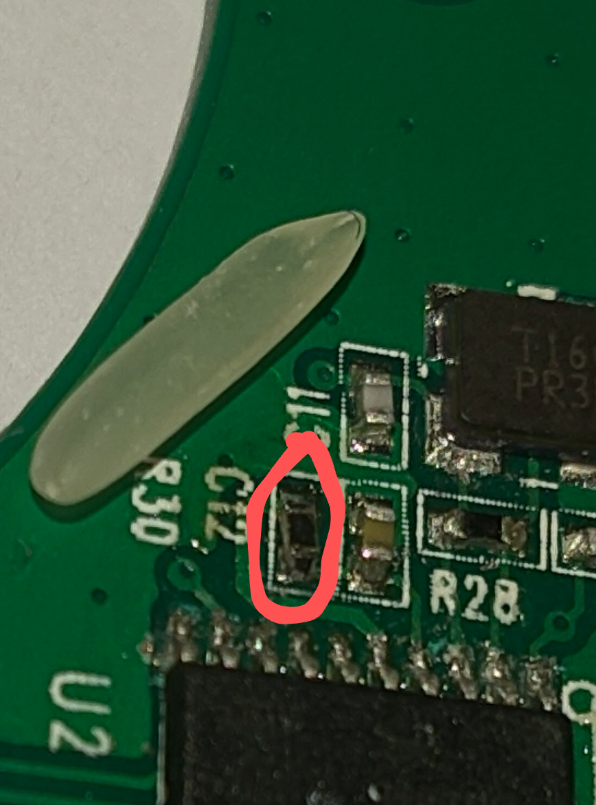
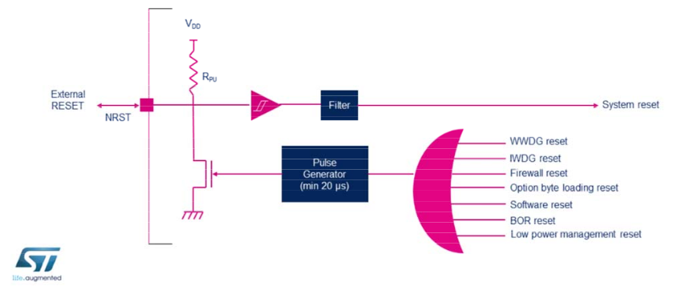

# Fixing the Reset Problems of the GD32 on the LDS-006 Board
## Morning 12.9.21 - Attempts to Fix
After much probing with an oscilloscope and logic analyzer, digging through source code and experimentation, I am still unable to figure out the source of the periodic resets. As far as I can tell the power supply is solid (powering via SWD 3v3 still causes the periodic resets). I have disabled the RCU (Reset and Clock Unit) of the CPU (somewhat equivalent to the RCC in STM32's, see [here](https://www.st.com/content/ccc/resource/training/technical/product_training/group0/c8/9e/ff/ac/7a/75/42/d1/STM32F7_System_RCC/files/STM32F7_System_RCC.pdf/jcr:content/translations/en.STM32F7_System_RCC.pdf)), and still the resets happen. I have also attempted to read the reset status bits from the `RCU_RSTSCK` register, but I wasn't yet able to determine the source of the reset (this is with the RCU enabled). I only quickly messed with this register, so perhaps I'm doing something wrong.

One observation that I made was that the external oscillator will stop for a short period of time every time the system resets. I think it stops _because_ of the system resetting, rather than the oscillator stopping causing the reset.

It isn't the serial comms causing it, since disabling everything apart from the LED toggle code still has it reset every 400ms. I have probed every pin and they all seem to be behaving the way I defined in the source code.

When I attach OpenOCD to the CPU, and try to `halt`, the CPU halts until the next "glitch" moment, at which point it resets and starts spewing out serial data again, so this could perhaps be some problem with the board / power supply. That also explains some of the weird behaviur I was getting when debugging with PlatformIO (break points would jump back to first one) which I originally assumed to be caused by my scuffed PlatformIO config. I think I am narrowing in on the source of the problem but it is very hard to tell.

___

## Afternoon 12.9.21 - Thought I'd Fixed It
IT WORKS! - It turns out that the reset pin was the problem! After temporarily pulling it high with a bit of wire the CPU now stays alive indefinitely.

<figure>

<figcaption style="font-style: italic;">
</figcaption>
</figure>

As we can see the CPU now counts up indefinitely, and doesn't periodically reset. It turns out that it is connected via a resistor to pin 5 of the CPU (that pin is VDDA, from the datasheet: _"VSSA, VDDA range: 2.6 to 3.6 V, external analog power supplies for ADC, reset blocks,
RCs and PLL. VDDA and VSSA must be connected to VDD and VSS, respectively."_). VDDA is indeed connected to VDD, the reset pin is connected through a resistor to VDDA. I think the resistor value is too high perhaps? Shorting out the resistor asserts enough of a voltage on the reset pin to stop the CPU resetting. The irony of the situation is I have had a comment in the bottom of `main.c` saying `TODO: Check reset pin` this whole time...

I measured the resistor on the working LDS-006 and it read about 90k, which was the same as on my "development" LDS-006 board. I tried replacing it with a 10k resistor (pictured below with a grain of rice for scale), however the reset was still happening. Below is the logic analyzer trace for the `NRST` pin, we can see that it is for some reason pulled low periodically (causing the resets). But measuring the other side of the resistor (connected to `VCCA`), the trace is rock solid. As far as I can currently tell, `NRST` isn't connected to anything else, so I can't quite tell why it is being pulled low. I just decided to short over that resistor to properly keep that pin high.

<figure>

<figcaption style="font-style: italic;">
</figcaption>
</figure>

<figure>

<figcaption style="font-style: italic;">
</figcaption>
</figure>

___

## Later Afternoon 12.9.21 - But it Actually Wasn't Fixed
Turns out it isn't quite as simple; the internal resets generate a low pulse on the NRST pin, so clamping that pin high is actually quite bad since software resets (from things like the watchdog or low power) would never complete. The diagram below is from the STM32 reference, but that basically applies to the GD32 as well.

<figure>

<figcaption style="font-style: italic;">
</figcaption>
</figure>

I replaced the short with another 100k resistor, now its back to trying to figure out where this reset is coming from. It must be an internal software reset pulling this pin low, and I would have figured that out if I had just read a few pages further in the reference document :/.

## Evening 12.9.21 - Finally Fixed Properly!!!
I wrote a small program to pretty print the value of the reset source register, and it turns out the resets are being caused by the free watchdog timer. I now just enabled and fed the watchdog each loop of printing a number, and, now, finally, I can say the problem is fixed. I can now run the below code, and as long as I feed the watchdog, it will run indefinitely!

```c
char buf[20];
for (int i = 0; i < 10000; i++) {
  delay_1ms(100);
  sprintf(buf, "%d ", i);
  print_str(buf);
  fwdgt_counter_reload();
}
```

In fact [this](https://stackoverflow.com/questions/53334571/disabling-stm32-hal-iwdg-or-wwdg-watchdog-before-stop-mode) SO post seems to hint that the `IWDG` (same as `FWDGT` - Free Watchfog Timer for GD32) watchdog timer is _always running_. I guess that is a good solution to 100% keep the system safe, but because I have been working from the GD32 datasheet, I didn't know this (the GD32F130 datasheet is very scarce on details, from now on I will try to reference the STM32 datasheet first). Some testing indicated that the `FWDGT` is automatically enabled at the lowest prescaler value, which equates to just over 400ms before a reset. Setting a delay of 400 doesn't cause a reset, but a delay over 450ms causes periodic resets. As a victory lap of sorts I wrote the function below, allowing me to delay indefinitely.

```c
/*
Quick and dirty function for arbitrary time delay
that will feed FWDGT automatically, assuming minimum
prescalar value of /4
*/
void delay(uint32_t millis) {
  fwdgt_counter_reload();
  uint32_t _millis = millis;
  if (_millis < 200) {
    delay_1ms(_millis);
    return;
  } else {
    while (1) {
      fwdgt_counter_reload();
      if (_millis < 200) {
        delay_1ms(_millis);
        return;
      } else {
        delay_1ms(200);
        _millis -= 200;
      }
    }
  }
}
```

___

In hindsight, all of the problems I faced when trying to run code on the GD32 were _relatively_ simple to solve, however my lack of experience with STM32/GD32 platforms, and a lack of documentation on the latter, meant that it was a lot harder to solve problems than perhaps it should have been. It was definitely a good learning experience to start this project, and I'm now more confident in writing a full firmware for the module.

Also upon more thinking I realise I got my watchdog prescaler timings the wrong way round; a low division will make the timer count much quicker. So I could just get around my cludgy delay function by setting the prescaler value to the max of /128.

___

## Links
- <https://www.st.com/content/ccc/resource/training/technical/product_training/group0/c8/9e/ff/ac/7a/75/42/d1/STM32F7_System_RCC/files/STM32F7_System_RCC.pdf/jcr:content/translations/en.STM32F7_System_RCC.pdf> - info on stm32 reset circuitry
- <https://stackoverflow.com/questions/53334571/disabling-stm32-hal-iwdg-or-wwdg-watchdog-before-stop-mode> - SO post on STM32 watchdog