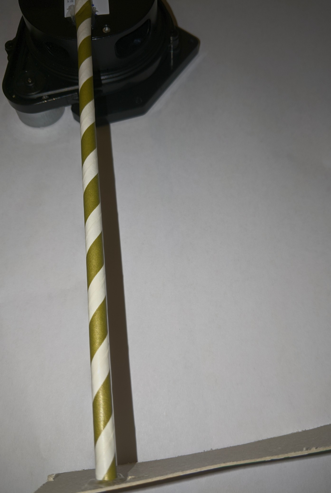
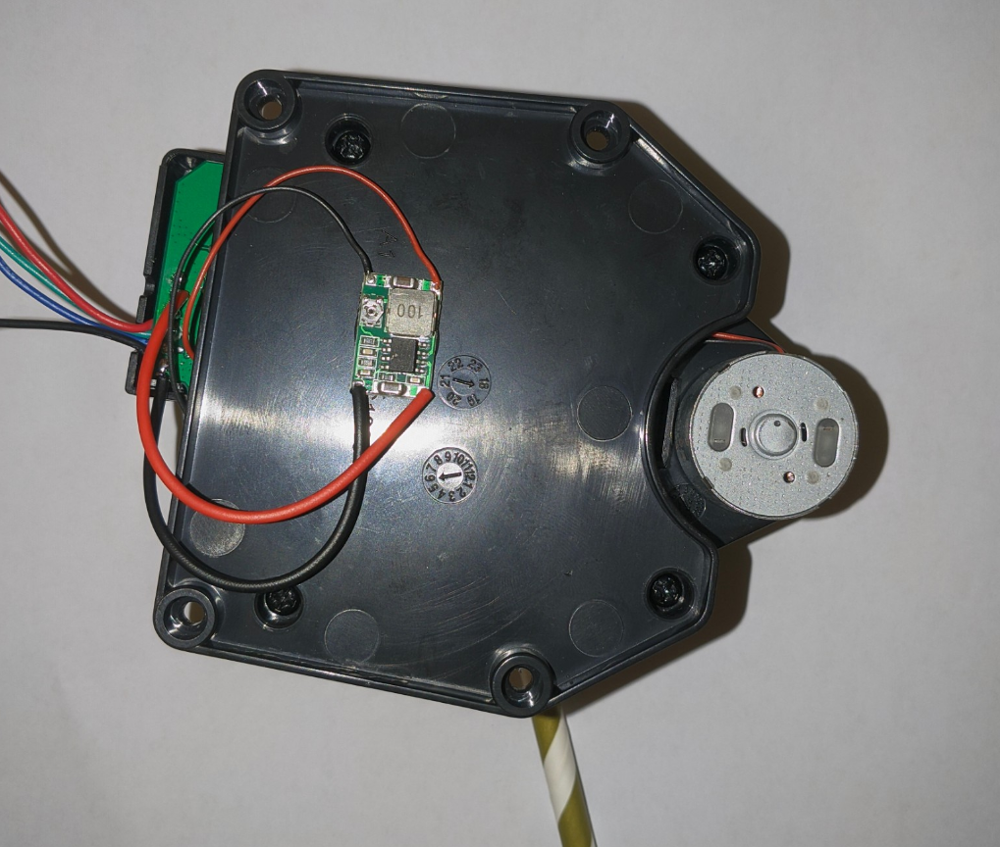
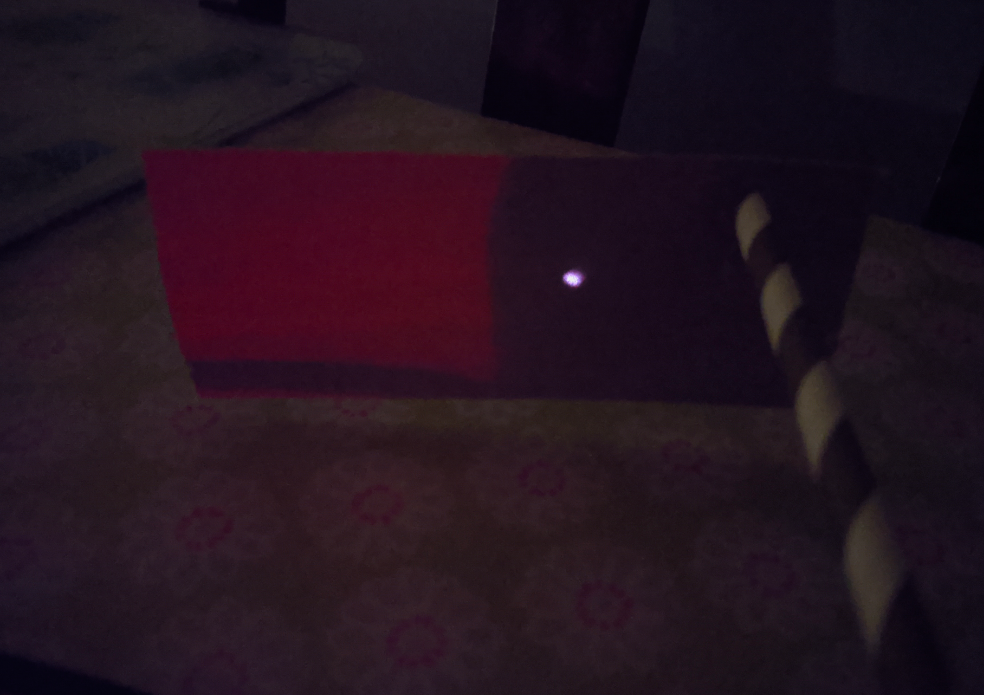
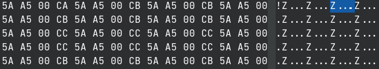
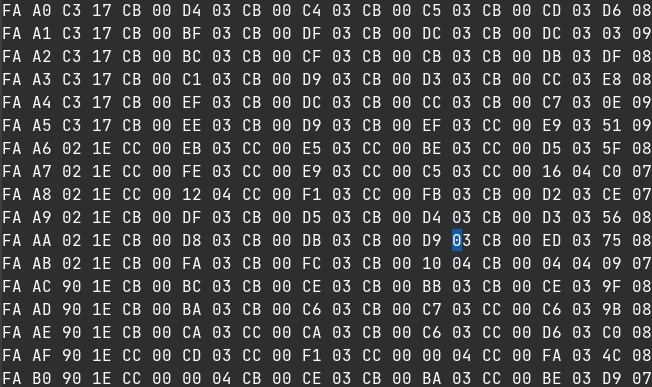
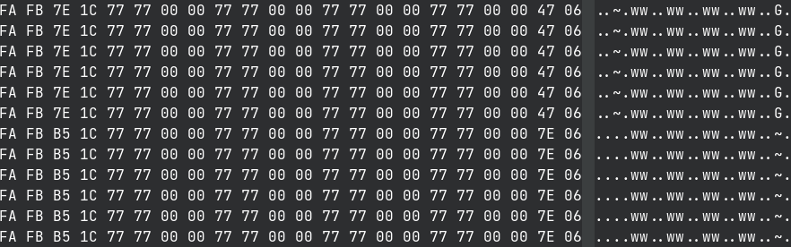
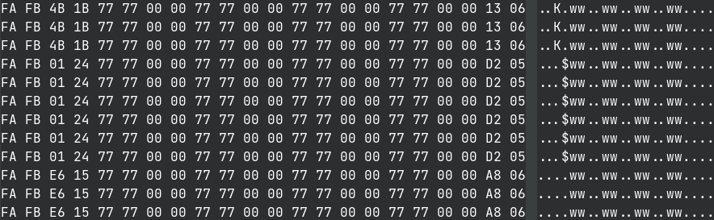
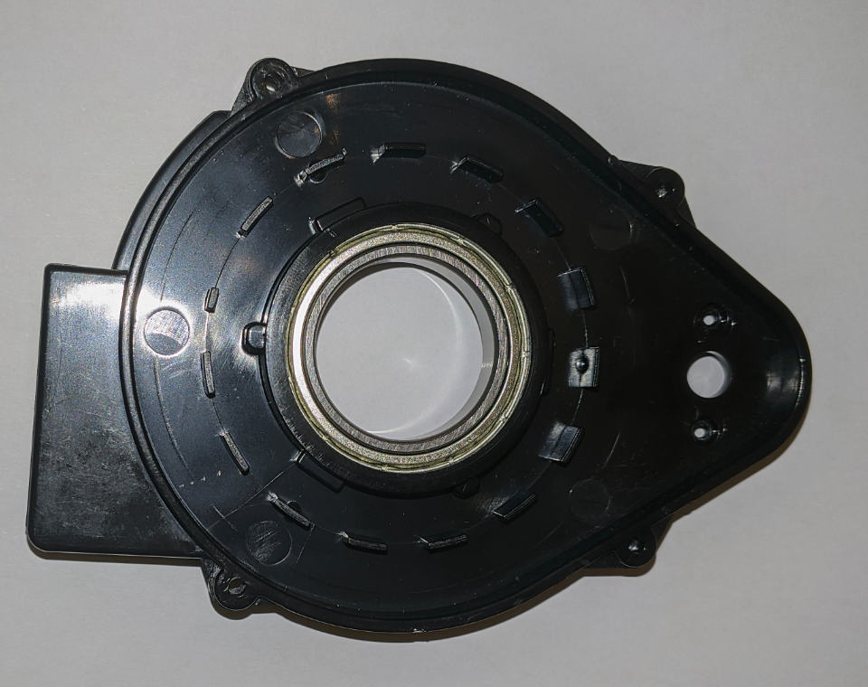

# Attempts to Decode Lidar Serial Data
This post is mainly just notes from my attempts to decode the data that comes from the stock LDS-006. I probed some test points which I think attached to the IR receiver, and the data that comes from it seems to be identical to that which is sent out over serial. Thus I will have to try and figure out what the data being sent via serial means before I start work on a custom firmware.

## Current Setup for Stock LIDAR
I have done a few things to try and make my life a bit easier with the stock LIDAR. For one, I have attached a small buck converter to 5v to power the motor. This means I get speed control of the motor (and thus don't need to figure out how to start the motor via software). I have also attached some cardboard on a straw to hopefully keep distance readings the same no matter where the LIDAR is pointed. I am not 100% sure if this has worked as of yet.

<figure>

<figcaption style="font-style: italic;">
</figcaption>
</figure>

- The cardboard on a straw mod

<figure>

<figcaption style="font-style: italic;">
</figcaption>
</figure>

- The buck converter used to power the motor

<figure>

<figcaption style="font-style: italic;">
</figcaption>
</figure>

- The IR laser point on the cardboard extension

## Structure of the Data
- When the LIDAR first starts spinning, some data is sent out that is different to the "standard" data
- It starts off with a repeating pattern of `5A A5 00 CB`, as shown below. I think during this time, the board is getting synchronised with the IR receiver (i.e. making sure it knows what data it is receiving). When the motor isn't spinning, this data is just sent indefinitely. When the motor starts spinning, this data continues to be sent for a few seconds, until (I assume) the base station (the stationary part of the LIDAR) CPU is synchronized with the incoming data, at which point new data is sent.

<figure>

<figcaption style="font-style: italic;">
</figcaption>
</figure>

- The new data that is sent is some packets starting `FA`, with the second byte monotonically increasing from `A0` to `FF`. I think this might be calibration data

<figure>

<figcaption style="font-style: italic;">
</figcaption>
</figure>

- After that, the "standard" data packets are sent out. These are packets starting `FA FB` and are 22 bytes in length, and they all have a very similar structure. In fact, they only differ by 4 bytes each (bytes 3,4,21 and 22)
- The packets are sent 6 times when the LIDAR is spinning slow enough, however past a certain speed threshold, the packet re-sending is reduced (I assume because the CPU can't handle the incoming data fast enough). I will refer to a "packet" as relating to a group of 6 _real data packets_, all of which are identical

<figure>

<figcaption style="font-style: italic;">
</figcaption>
</figure>

- I think I have worked out that byte 4 of the standard packets correlates to the angle data; there are 14 light blocking protrusions in the base of the LIDAR, which the spinning part reads with a photoelectric fork sensor
  - One of the protrusions is about half the width of the others. Every 14 packet cycles (remember each packet is sent 6 times), that byte jumps up to a value different to the others, making me think it relates to the time when the fork sensor is reading a 1 (i.e. when the light isn't being blocked)

<figure>

<figcaption style="font-style: italic;">
</figcaption>
</figure>

- As we can see, the 4th byte jumps up to `24`, when the other packets had it hovering around `13` to `15`
- Some experimentation also indicated that the magnitude of that value is proportional to the speed of the spinning assembly; a faster speed results in a lower value

<figure>

<figcaption style="font-style: italic;">
</figcaption>
</figure>

- We can see the ring of 15 protrusions in the base
- Byte 22 (the last byte) seems to always stay in the range `05` to `06`. To clarify, this is the same behaviour as when I didn't have the distance-locking cardboard extension in place, so I don't think this is distance data

___

- So now I am stuck with figuring out what bytes 3 and 21 are for
- I did actually hook into the UART port exposed on the spinning assembly. I think this port was just shooting out distance data from the lidar, since I could see visible patterns when moving my hand closer and further away from the sensor - this is a future area which I would like to look more into
- My job now is to properly read the data coming from the IR receiver to see if it is the same as the data being sent over serial; if it is then I can be sure that these packets contain the distance data somehow
  - I can confirm this because there is no base PCB to spinning part communication, thus any sort of synchronisation / configuration isn't possible