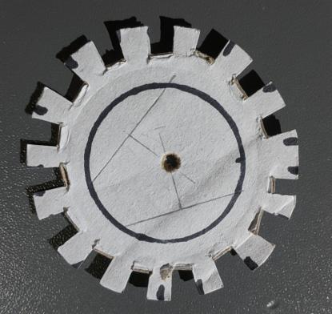
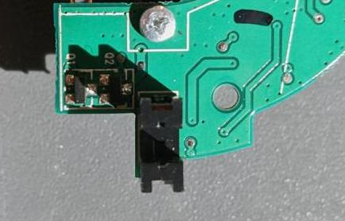
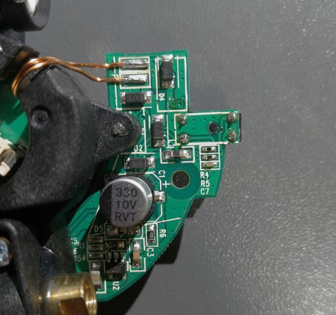

# Efforts in Making Sense of Serial Data
As mentioned previously, I originally decided to use a bit of cardboard with teeth cut into it to emulate the spinning of the laser assembly, but some experimentation showed that it was definitely harder than it looks (getting correct teeth spacing, centered etc.). I now plan to just hook directly into the photoelectric fork sensor with an Arduino and use it to emulate the periodic inputs that the uController expects.

<figure>

<figcaption style="font-style: italic;">
</figcaption>
</figure>

## Simple Teeth Timing Calculation
For 1 revolution per second. 15 teeth, so 30 toggles. Each toggle would be 0.033s, but since one tooth is smaller than the rest, one gap should be longer. Eyeballing the ratios in size it should probably be about 1.5 times as long, so one "gap" toggle should be 0.0495s and the "tooth" portion 0.0165s.

## The Fork Sensor
<figure>

<figcaption style="font-style: italic;">
</figcaption>
</figure>

<figure>

<figcaption style="font-style: italic;">
</figcaption>
</figure>

The pin closest to the diode (that isn't ground) is the digital output of the sensor. It goes high when being blocked by a tooth, and else low. So we know during the "gap" time of the Arduino program we should pull low.

**MORE TO ADD**