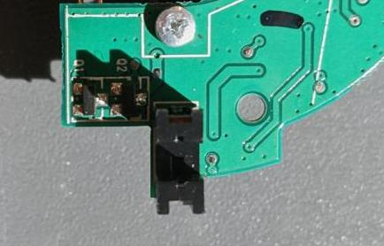
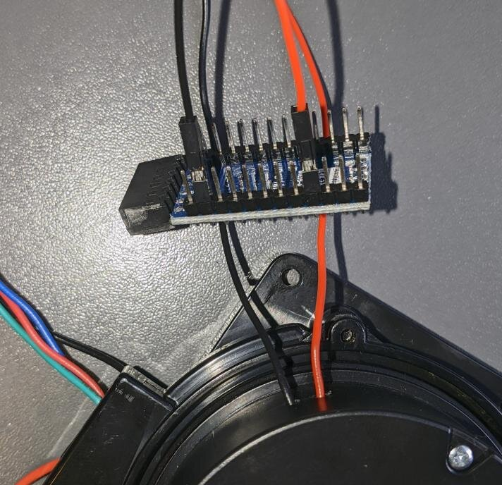
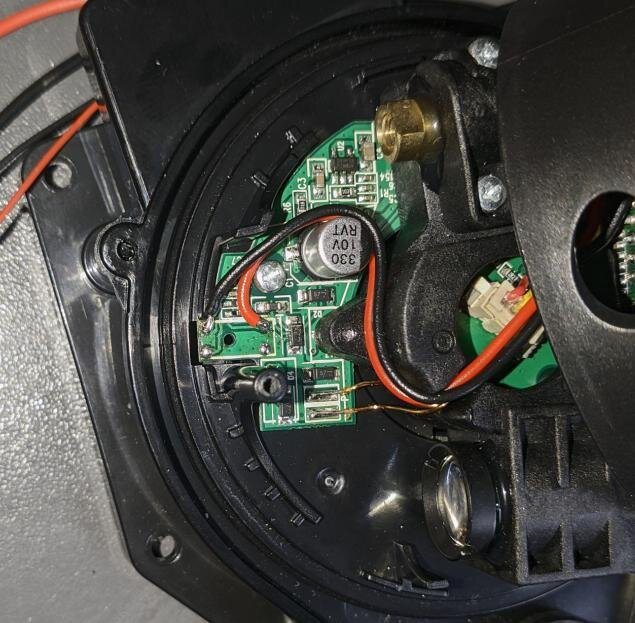
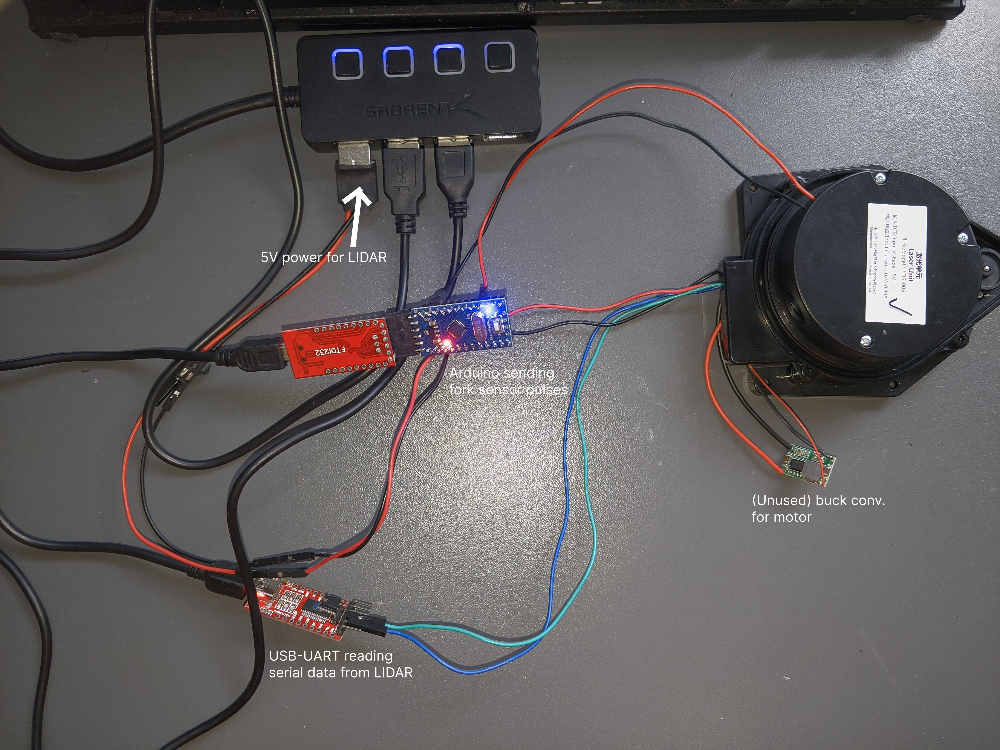
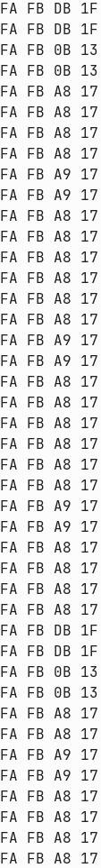
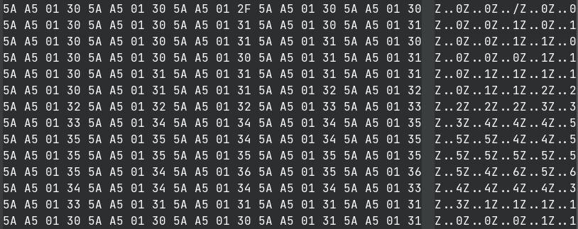

# Efforts in Making Sense of Serial Data
As mentioned previously, I originally decided to use a bit of cardboard with teeth cut into it to emulate the spinning of the laser assembly, but some experimentation showed that it was definitely harder than it looks (getting correct teeth spacing, centered etc.). I now plan to just hook directly into the photoelectric fork sensor with an Arduino and use it to emulate the periodic inputs that the uController expects.

<figure>

<figcaption style="font-style: italic;">
</figcaption>
</figure>

## Simple Teeth Timing Calculation
For 1 revolution per second. 15 teeth, so 30 toggles. Each toggle would be 0.033s, but since one tooth is smaller than the rest, one gap should be longer. Eyeballing the ratios in size it should probably be about 1.5 times as long, so one "gap" toggle should be 0.0495s and the "tooth" portion 0.0165s.

## The Fork Sensor
<figure>

<figcaption style="font-style: italic;">
</figcaption>
</figure>

<figure>

<figcaption style="font-style: italic;">
</figcaption>
</figure>

The pin closest to the diode (that isn't ground) is the digital output of the sensor. It goes high when being blocked by a tooth, and else low. So we know during the "gap" time of the Arduino program we should pull low.

______

After desoldering the fork sensor from my working LIDAR, and some inspection of the circuit, there is a 4.7k pullup for the output, and a 100 ohm current limiting resistor for the IR LED. Below are pictures of my setup. I wanted to replace the internal plastic light shield around the laser / detector, and the top cover, to try and keep the working conditions the same as the unmodified version.

<figure>

<figcaption style="font-style: italic;">
</figcaption>
</figure>

<figure>

<figcaption style="font-style: italic;">
</figcaption>
</figure>

Now using a (quite messy) setup, I can read serial data from the LIDAR as before, and the readings on byte 4 are much more consistent (since they are controlled by an Arduino rather than a physical spinning motor).

<figure>

<figcaption style="font-style: italic;">
</figcaption>
</figure>

<figure>

<figcaption style="font-style: italic;">
</figcaption>
</figure>

## Data Without Arduino Pulses - Some Success
It turns out that the data being sent before the LIDAR assembly starts spinning isn't just a set sequence of bytes. Moving a perpendicular barrier towards and away from the LIDAR produces data that seems to change based on the distance. The packets seem to be 4 bytes long, sent 3 times, and byte 4 of the packets is directly related to the distance the LIDAR measures; closer causes a smaller value.

Byte 3 seems to be some flag. It is `0x01` when valid data is being sent back, and `0x00` when invalid data is sent back. This invalid data seems to be sent when the "wall" is too close to the sensor. It also switches to `0x06` in some cases, although I can't figure out when. Data stops being sent when the angle of the wall to the LIDAR becomes too steep. Like most LIDAR systems, the LDS-006 only works with approximately perpendicular walls.

<figure>

<figcaption style="font-style: italic;">
</figcaption>
</figure>

A distance of ~30cm produces distance bytes in the range `0x4E` to `0x50`. Moving the "wall" closer causes byte 4 to decrease tp `0x00` until about 25cm, at which point that "valid data" flag switches to `0x00` and no valid data is sent.

**MORE TO COME**

## Notes to Self
With big inductor at north of board, second top resistor in left hand 5 resistor network thing seemingly connects to the south most pin of the IR data receiver, through a 4.7k resistor. It connects through to pin 18 of the uC. Maybe the resistors near the unknown 8 pin IC that connect to the south-most pin of the IR receiver form a divider network that drops the output to 3v3?

The south most pin of the IR receiver is connected through to the 5v input directly. The other pin of the IR receiver connects to pin 2? of the unknown IC. That will be our data signal I think. Online circuits seem to suggest putting the cathode output of the 2 pin photodiode through an op-amp.

The IR photodiode looks like an SFH2701 from OSRAM, or a knockoff of such.

AAAHHHH - finally deciphered markings on unknown IC - its an LM393. Power supply pins match up, pin 4 (that goes off to uC) is output 1.

Data coming from output of LM393 is (I think) inverted - TODO: Try inverting back in Saleae