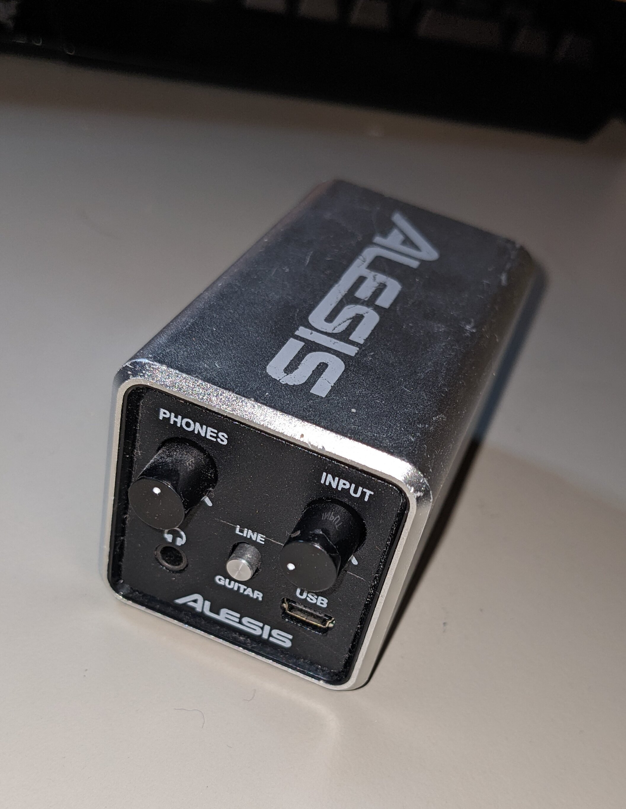
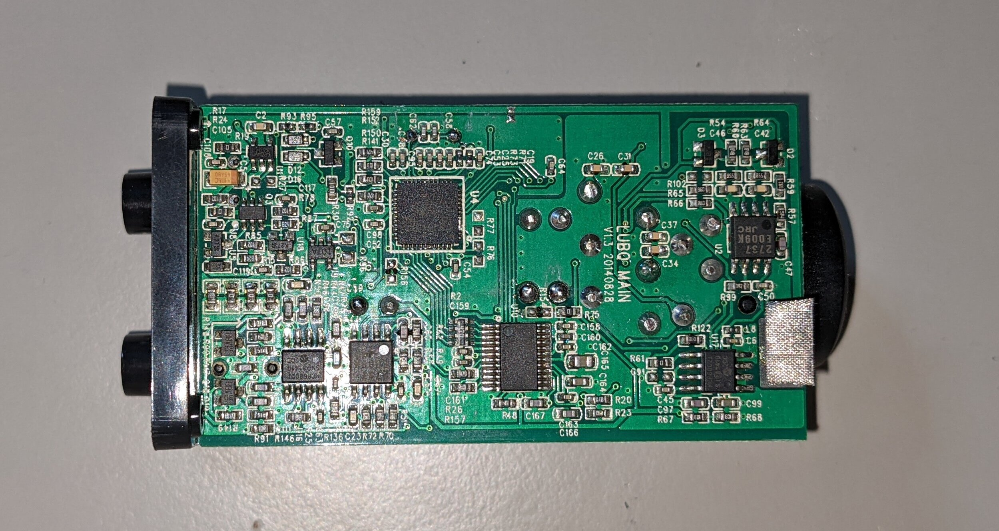

# Alesis Core 1 Audio Interface Input Level Fix

<figure>

<figcaption style="font-style: italic;">
</figcaption>
</figure>

I bought a second hand Alesis Core 1 audio interface from eBay a while back and I haven't really used it because of a problem with the input level control knob. When changing the level, the output can be heard crackling and jumping between audio levels. This behaviour can be exacerbated by pressing into the dial, which led me to think that the potentiometer wipers not making proper contact to the resistance wire? PCB? stator? - whatever the non spinny part of the potentiometer is called.

<figure>

<figcaption style="font-style: italic;">
Potentiometer in Question ("INPUT")
</figcaption>
</figure>

## Disassembly
<figure>

<figcaption style="font-style: italic;">
Underside of PCB
</figcaption>
</figure>

<figure>

<figcaption style="font-style: italic;">
Side View
</figcaption>
</figure>

<figure>

<figcaption style="font-style: italic;">
Removing the Front Panel
</figcaption>
</figure>

Getting inside the thing wasn't too difficult; just some screws underneath the decal stickers. The front panel is detachable with a ribbon connector and a PCB interconnect, making life a bit easier for the repair. There is a surprising amount packed into this small interface.

## Fixing in Progress
<figure>

<figcaption style="font-style: italic;">
Bad Potentiometer Desoldered
</figcaption>
</figure>

I desoldered the misbehaving potentiometer, resorting to just cutting the metal shield from the solder pads - it was to much of a pain to desolder because of the high thermal mass. 

<figure>

<figcaption style="font-style: italic;">
Inside the Potentiometer
</figcaption>
</figure>

Taking apart the component it is clear to see the wipers on the underside of the spinny bit? rotor? knob?

<figure>

<figcaption style="font-style: italic;">
Pulling the Wipers Up a Bit
</figcaption>
</figure>

I used a pair of tweezers to pull up on the wipers so that they would hopefully make better contact with the PCB. This was quite a delicate job but thankfully I managed to keep the part intact.

___

<figure>

<figcaption style="font-style: italic;">
Cracks on the PCB????? 😳
</figcaption>
</figure>

I did see these strange crack looking things on the underside of the potentiometer PCB, I'm not sure if they are a problem or whether they are just superficial, but the only way to find out is to check. Ideally I would have bought a new potentiometer to swap this one out for, but finding an exact replacement won't be easy†.

___

<figure>

<figcaption style="font-style: italic;">
Resoldering
</figcaption>
</figure>

Anyway I resoldered the potentiometer to the PCB, making sure to keep it aligned with the other one so that it would fit into the front panel.

<figure>

<figcaption style="font-style: italic;">
Glued it Down
</figcaption>
</figure>

Because I cut the aforementioned metal shield, I had to use some hot glue to make sure the component was at least somewhat secured down; it sits on the beep boop electricity to gorilla interface, so making it physically secure is important.

## Fixed!
<figure>

<figcaption style="font-style: italic;">
Testing
</figcaption>
</figure>

Before putting the device back together I tested it outside of the PCB, and amazingly the issues were fixed!!! No more does the interface have a non responsive input level knob and weird crackles.

<figure>

<figcaption style="font-style: italic;">
Put Back Together
</figcaption>
</figure>

Finally I put the device back together, and felt immense satisfaction in knowing I will get more use out of this surprisingly versatile little interface.

## Closing Thoughts
Repairable devices are wonderful. Having the ability to fix something that would otherwise just be sent to landfill is empowering and is something I wish was the default for device manufacturers, rather than just an afterthought (or in some cases a "repairwashing" effort, ahem Apple††).

At some point I may end up looking for a replacement potentiometer and making the repair more permanent, but at least temporarily this seems to have gone very much to plan 😁.

___
† One thing I thought of after the fact was that perhaps the interface was dropped onto the front panel at one point, causing the cracks on the PCB and the wipers to compress and not fully decompress. Such an accident would explain the audio problems and the cracks in the PCB.

†† Yes I am aware of the hypocrisy of that comment when I am currently typing this on a Macbook Pro