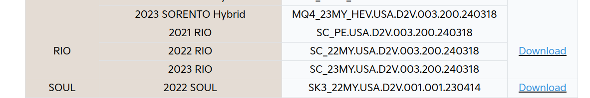
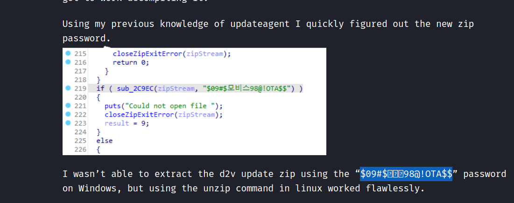
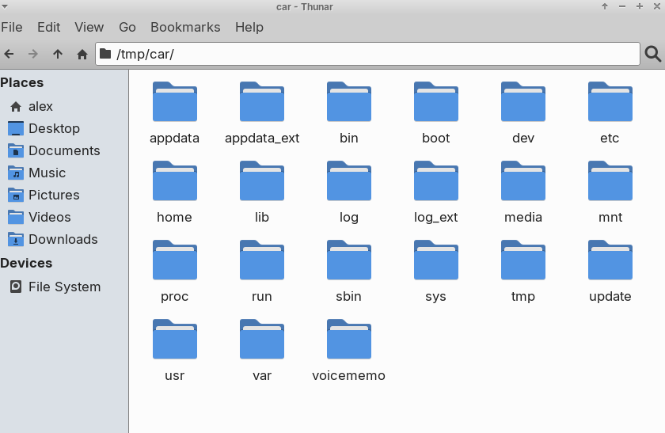
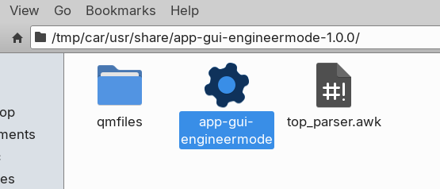
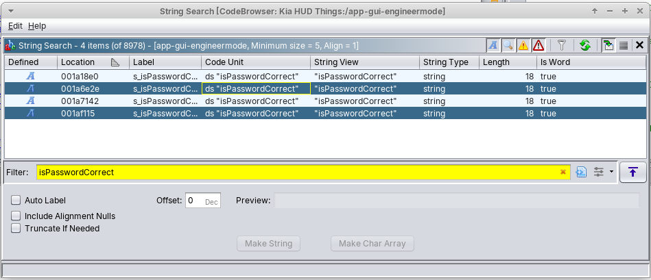
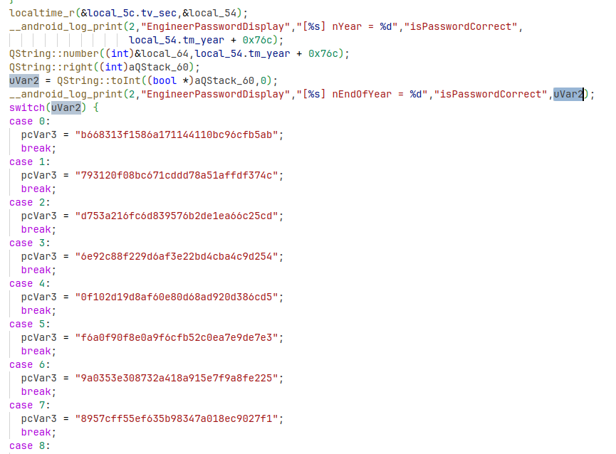
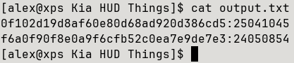
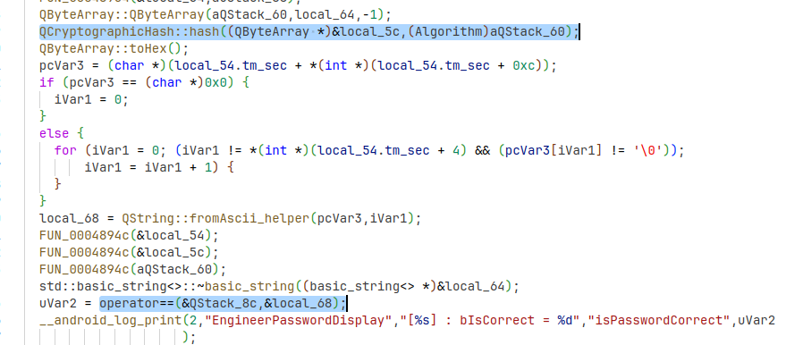

# Kia Rio D2V Headunit Reverse Engineering
## Initial Research
I had my headunit replaced in my Kia Rio and this caused a problem. I was able to access "Engineering Mode" (basically a bunch of debug and system configuration things) in order to *disable* wireless Apple CarPlay (because I plug my phone in anyway so I'd rather just use wired). It was accessible through the default password of 2400, and inside this menu you could switch the "CPU variant" to "1" from "2" in order to trick the headunit into thinking it didn't have WiFi capabilities (for some stupid reason wired CarPlay is disabled when you are using wireless, although wired Android Auto still works, go figure 🤷‍♂️). 

However since the headunit was replaced, I seemingly got a new software version installed that had an 8 digit passcode. Doing some digging online lots of people referenced a set of 8 digit codes from decompilation of the firmware, but after trying a couple of them, I started getting sweaty palms since the car limits how many times you can retry. So in order to not disable my headunit, I needed to do some digging around the firmware. 

## Getting the Update File

Doing some research uncovered that Kias and Hyundais use either Android based software, or a more barebones Linux / Qt UI. Messing with my car made me realise it wasn't Android, so I did some more digging and found references to the "D2V" platform. I then stumbled upon [this](https://programmingwithstyle.com/) amazing blog which detailed basically all of the information I needed. It however didn't specify which passcode to use for engineering mode, but it did offer lots of very useful information, so a lot of the info in this post is based off of that. The blog linked to the Kia update website (update.kia.com) where you could download a D2V update zip if you set your region to US (for some reason updates are not possible if you are in the EU, only map updates). I downloaded the update:

<figure>

<figcaption style="font-style: italic;">
Update files
</figcaption>
</figure>

Which said it was compatible for 2021 Rios (my car). I then decrypted it with the password in [this post](https://programmingwithstyle.com/posts/howihackedmycarpart5/) specifically, making sure to take care with the Korean characters in it 😳:

<figure>

<figcaption style="font-style: italic;">
Zip password
</figcaption>
</figure>

## Exploring the Root FS
Once it was all extracted I was presented with two separate directories, but apparently they are both basically identical 🤷‍♂️.

Some exploration of these folders led me to the `enc_system` directory, specifically `system.img`. Some quick `file` and `binwalk`ing uncovered that it wasn't encrypted!

Mounting the image (`sudo mount -t ext4 -o loop system.img /tmp/car/`) gave me a lovely root FS of the headunit:

<figure>

<figcaption style="font-style: italic;">
Root FS 
</figcaption>
</figure>

A bit of `grep`ing led me to the engineering mode app:

<figure>

<figcaption style="font-style: italic;">
Engineering mode application
</figcaption>
</figure>

This was my target! Importing into Ghidra was simple, it all decompiled with the default / detected options. I then did some searching for "password" in strings and labels, then found the `isPasswordCorrect` string scattered around:

<figure>

<figcaption style="font-style: italic;">
References in Ghidra
</figcaption>
</figure>

This seemed quite promising... Looking at the decompilation of the enclosing function where the strings are found, we could see some veeeerrry interesting logic:

<figure>

<figcaption style="font-style: italic;">
Bingo
</figcaption>
</figure>

## Cracking the Passcodes
Thanks to some nice debug logging, we uncover the likely area where the password is checked. We can see a set of hashes, and some references to `nEndOfYear` which confirms some sources online saying the passwords are linked to the system time year. These hashes look like MD5 so it should be easy to crack them with Hashcat, given that we are looking for an 8 digit numeric string. I made a bold assumption that the switch cases correspond to the current year end digit, so I ran the Hashcat command (`hashcat -m 0 -a 3 -o output.txt hash.txt ?d?d?d?d?d?d?d?d`) against the hash for 202**4** and got a crack!

We can see references to `EngineerPasswordDisplay` which implies that this code is for the engineering mode screen, but I still need access to the variant coding menus. Thankfully the other string reference shown in the Ghidra screenshot above linked to basically identical logic except with a different set of hashes and some logging for `VariantPasswordDisplay`. I again used the forth hash for 202**4** and plugged it into Hashcat, and again got a crack!

<figure>

<figcaption style="font-style: italic;">
The cracked passwords
</figcaption>
</figure>

The screenshot above shows the two hashes and the corresponding passwords, the top for engineering mode and the bottom for variant coding.

Below we can see the high level logic of the operation (ignoring all the Ghidra funkiness). It seems to just be calculating a hash of the inputted string, then checking for equality with the hash that corresponds to the current year's least significant digit.

<figure>

<figcaption style="font-style: italic;">
The hashing logic
</figcaption>
</figure>

Again I can make a lot of assumptions here from all the research / reading, going into this blind would have been a bit more work 😅

## Grand Finale
It's all fun and games until it comes to actually trying these, again I had limited retries of these passwords due to the lockout behaviour, so I definitely had sweaty palms. Accessing the engineering mode menu requires a series of taps (see bottom of page), and low and behold using the password `25041045` worked!! I re-gained access to my beloved engineering mode, and I could then access the variant coding menu. Again it is hidden behind the passcode but the code `24050854` worked as well!! Finally I could disable damned wireless CarPlay.

___

### Accessing Engineering Mode
To access the engineering mode screen on the D2V headunit, simply go to the system settings, then "General", where you should see the firmware version and an "Update" button. Tapping 4 times to the left of the update button, and once to the right should bring up the passcode screen. You will likely need to repeat this tapping pattern many times until it works. If you encounter a 4 digit passcode, it is likely you are running an older headunit firmware, and the code `2400` *should* work. The variant coding passcode is `1200`. If you encounter an 8 digit passcode screen, using the passcodes above should work (at least if the year is 2024 - I will post the full list of passcodes for every year if I remember).