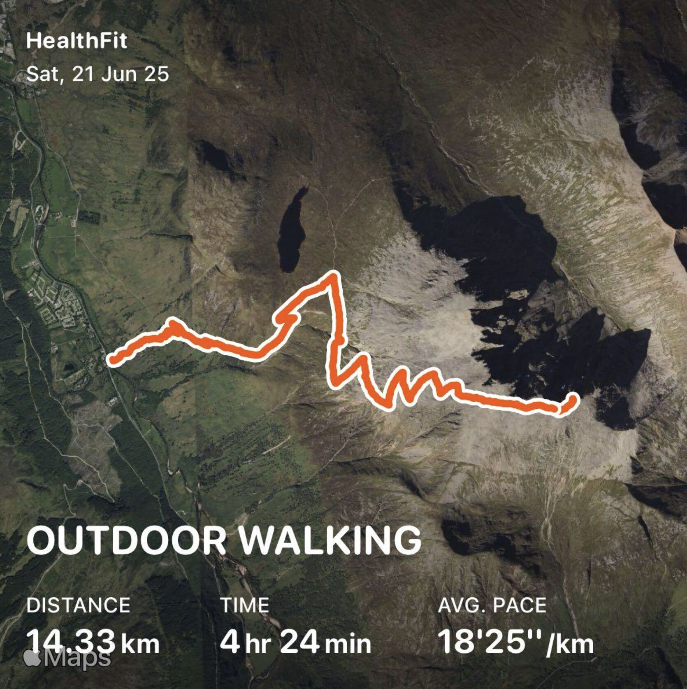
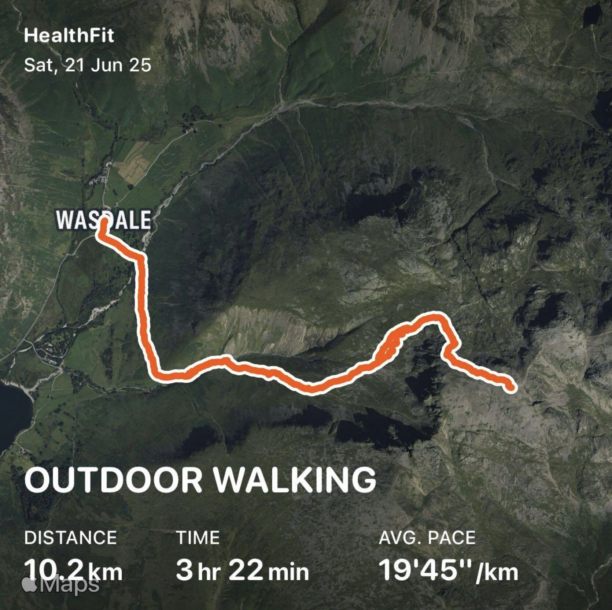
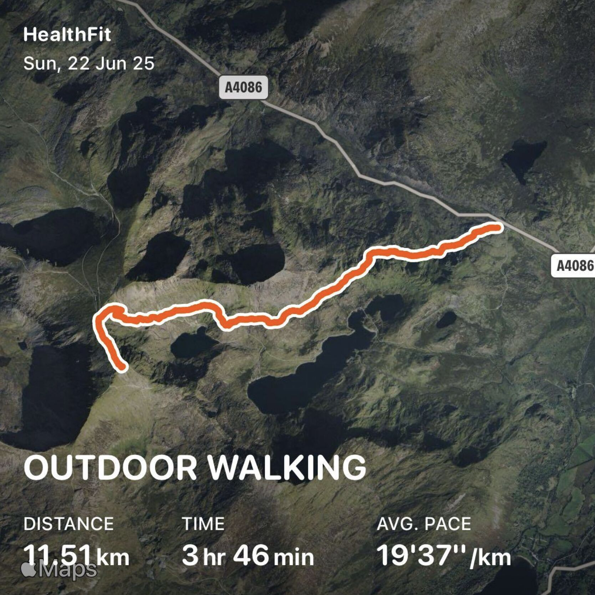

# Three Peaks 2025
On Saturday 22nd and Sunday 23rd June 2025 I completed the three peaks challenge with a group of friends. The aim of this challenge is to climb and descend the three tallest mountains in the UK - Ben Nevis (Scotland), Scafell Pike (England) and Yr Wyddfa (Snowdon) - in under 24 hours (including travel). We completed the challenge with 7 minutes to spare!

### Stats
- Total walking time: `11hrs 31mins`
- Total steps: `62149`
- Total distance: `36.04km`
- Total elevation gain: `3228m`
- Total active calories: `5192kcal`
- Total challenge time: `23hrs 53mins`
- Time driving: `11hrs 4mins`

### Ben Nevis
<figure>

<figcaption style="font-style: italic;">
Ben Nevis
</figcaption>
</figure>

The tallest of the peaks, started at 6am. We started a bit too strong, finding ourselves out of breath within 15 mins. After adjusting our pace a bit we managed the climb in a pretty respectable time. No major issues.

### Scafell Pike
<figure>

<figcaption style="font-style: italic;">
Scafell Pike
</figcaption>
</figure>

The easiest of the three, we had found our (literal) stride for this climb.

### Yr Wyddfa (Snowdon)
<figure>

<figcaption style="font-style: italic;">
Yr Wyddfa (Snowdon)
</figcaption>
</figure>

Yr Wyddfa was meant to be relatively okay to finish off, however strong wind, rain and a thick fog set in as we started that made it a very challenging climb. Despite the very real danger involved we made it to the top convinced that we weren't going to make time. However a slightly easier (if very delirious) descent allowed us to complete the challenge with 7 minutes of our 24 hours to spare! 

___

This was an incredible physical and mental challenge that I am very proud of completing. I would recommend anyone attempting the challenge to drive in a car with air conditioning 🫠