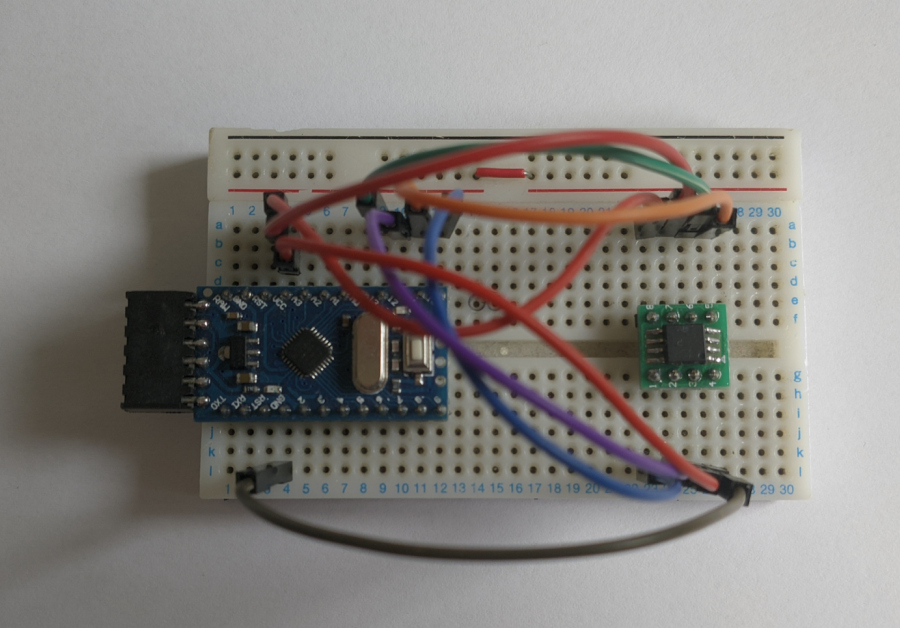

# Arduino EEPROM Dumper
This was a project I originally built to try and fix an ethernet HomePlug adapter which had stopped working. I was pretty sure it _wasn't_ the EEPROM that had died, but I had always wanted to mess with 25 series EEPROMs so it gave me a good opportunity to do so. I just send the raw data over serial, then use `picocom` to read the data into a file. I have desoldered and dumped EEPROMs from at least 4 other devices now, exploring the dumps is fun, but I should probably restrain myself from destroying too many more things just to dump the EEPROM...

<figure>

<figcaption style="font-style: italic;">
</figcaption>
</figure>