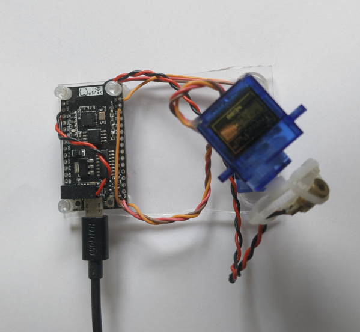
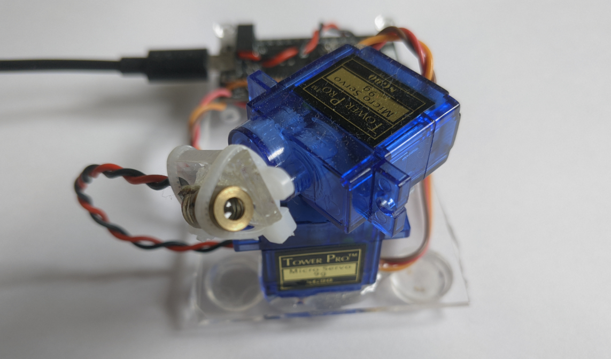

# ESP8266 Laser Turret
Just an ESP8266 controlling two servos and a laser pointer. Offers basic HTTP API for control (`GET http://laser.lan/setPos?x=90&y=90`) and not much else at the moment. I plan to build a computer vision system to point the laser at interest points using stuff I am learning in a computer vision module at university.

<figure>

<figcaption style="font-style: italic;">
</figcaption>
</figure>

<figure>

<figcaption style="font-style: italic;">
</figcaption>
</figure>

Information and code can be found [here](https://github.com/0x416c6578/arduino-projects/tree/main/Laser_Turret).