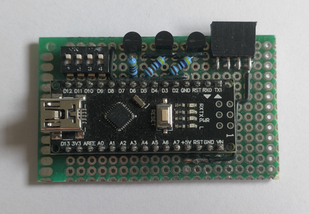
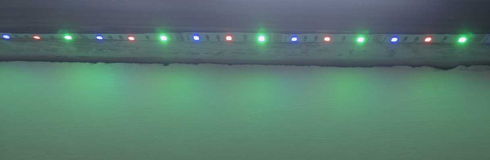

# Arduino Based LED Strip Controller
This was a simple controller for an RGB LED strip (one wire per colour) using some BC337's for low-side switching the different channels (the max current draw was under the BC337's rated max). The Arduino gets a bit warm because USB power goes through a schottkey diode (I assume for polarity protection, although its a USB port so I'm not sure why it's needed), but the power dropped over the diode is less than its rated max, so I don't think its really a problem.

I added a dip switch to the board for offline presets, although I have some 433 MHz radios I would like to use for remote control in the future.

<figure>

<figcaption style="font-style: italic;">
</figcaption>
</figure>

<figure>

<figcaption style="font-style: italic;">
</figcaption>
</figure>

Information and code can be found [here](https://github.com/0x416c6578/arduino-projects/tree/main/LED_Strip).