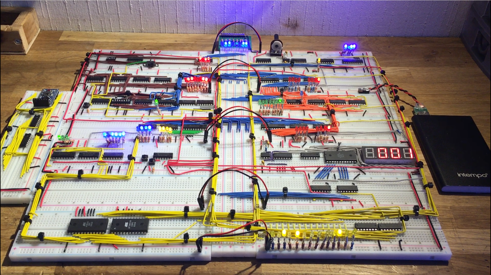

- This was a project I did for school
- It was mostly based on the work of [Ben Eater](eater.net) and is amazing YouTube series on the work of A.P.Malvino in _Digital Computer Electronics_
- All components were sourced off of Aliexpress over about 2 months, and the build process took about 4 months (delivery times could take up to a month)
- Using a full bus-width memory bus (for 256 bytes memory) would be quite easy to implement and is something I would like to do in the future
- I used an Arduino to write a program into RAM on bootup; the code can be found below, or the repo [here](https://github.com/0x416c6578/sap1-programmer)
